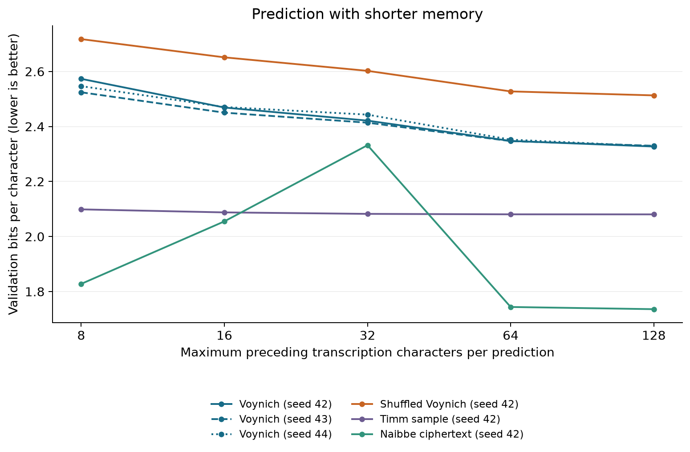
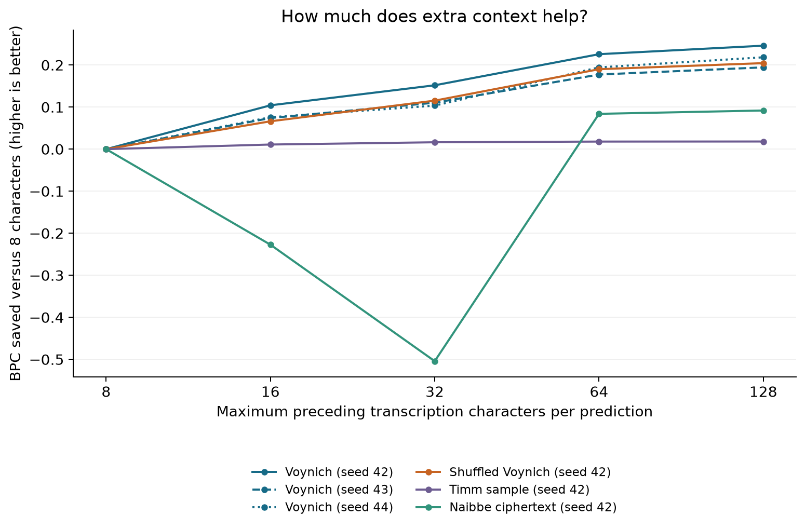

# Voynich memory test

Pattern: **context ablation**. Shorten the history of a fixed model to measure how its predictions change.

Across three Voynich GRUs, mean loss changes from 2.5482 BPC at 8 characters to 2.3286 at 128; 64 characters recover 90.7% of that measured improvement.

**Context:** preceding normalized transcription characters, including spaces and line breaks.
**BPC:** bits per scored character; lower means better prediction.
**GRU:** the small recurrent predictor already trained on each dataset.

```text
Load each saved GRU; verify weights and dataset hashes
For each context in 8, 16, 32, 64, 128:
    Reset state before every validation target
    Read at most that many preceding symbols from its own page
    Predict the same next character; save loss by page
Compare context gains within each dataset
Keep final-test pages sealed
```

## What was done

- Evaluated six frozen GRUs at five context lengths: 30 evaluations on the local Apple GPU.
- Used three training seeds for intact Voynich and one each for shuffled Voynich, Timm, and Naibbe.
- Verified source weights and inputs before and after scoring; checked exact target hashes against previous models and baselines.
- Saved per-page scores, folio bootstrap intervals, and two graphs. No retraining, downloads, or paid compute.

## Why it was done

The earlier GRU result showed strong prediction without language pretraining. This experiment asks how much of that prediction depends on the nearby text versus a longer history.

## Results



The curves show each model on its own dataset. Absolute scores across the four different texts are not a model ranking or a test of meaning.

| Data | Seed | 8 | 16 | 32 | 64 | 128 |
|---|---:|---:|---:|---:|---:|---:|
| Voynich | 42 | 2.5734 | 2.4691 | 2.4215 | 2.3476 | 2.3273 |
| Voynich | 43 | 2.5245 | 2.4505 | 2.4140 | 2.3470 | 2.3300 |
| Voynich | 44 | 2.5468 | 2.4710 | 2.4433 | 2.3523 | 2.3284 |
| Shuffled Voynich | 42 | 2.7178 | 2.6515 | 2.6024 | 2.5277 | 2.5133 |
| Timm sample | 42 | 2.0989 | 2.0879 | 2.0825 | 2.0808 | 2.0807 |
| Naibbe ciphertext | 42 | 1.8280 | 2.0552 | 2.3321 | 1.7440 | 1.7361 |



Each curve subtracts its own 8-character loss. This is a descriptive comparison: the texts, selected checkpoints, and training histories differ.

1. **Amount of useful history.** On intact Voynich, extending 32 to 128 characters saves 0.0977 BPC on average; extending 64 to 128 saves 0.0204. The 8-to-32 change recovers 55.5% of the measured 8-to-128 improvement; 8-to-64 recovers 90.7%. This fraction is not a share of all manuscript structure.
2. **Control comparison.** Extending 8 to 128 characters saves 0.2196 BPC for Voynich (three-seed mean) and 0.2046 for shuffled Voynich (one seed). Much of the context benefit survives word shuffling within lines. The Timm sample gains only 0.0182 BPC. None of these differences identifies meaning.
3. **Training mismatch.** Naibbe worsens from 1.8280 BPC at 8 characters to 2.3321 at 32, then improves to 1.7361 at 128. The original evaluator independently reproduces this curve. These GRUs were trained with 128-character windows and stride 64; most scored training targets had 65–128 preceding symbols. A state reset after only 8–32 symbols changes that setting. The curve cannot separate distant information from the effect of giving the recurrent state more warm-up.

## Uncertainty

Positive gain means the 128-character condition predicts better. Paired 95% percentile bootstrap intervals resample 15 folio groups, with 2,000 draws and seed 42. They describe page sampling, not training-seed variation or uncertainty from choosing checkpoints on validation.

| Data | Seed | Context change | Gain (BPC) | 95% folio interval |
|---|---:|---|---:|---|
| Voynich | 42 | 32 → 128 | 0.0942 | [0.0838, 0.1049] |
| Voynich | 42 | 64 → 128 | 0.0202 | [0.0141, 0.0272] |
| Voynich | 43 | 32 → 128 | 0.0840 | [0.0719, 0.0958] |
| Voynich | 43 | 64 → 128 | 0.0170 | [0.0124, 0.0224] |
| Voynich | 44 | 32 → 128 | 0.1149 | [0.0950, 0.1310] |
| Voynich | 44 | 64 → 128 | 0.0240 | [0.0185, 0.0288] |
| Shuffled Voynich | 42 | 32 → 128 | 0.0892 | [0.0752, 0.1000] |
| Shuffled Voynich | 42 | 64 → 128 | 0.0144 | [0.0100, 0.0206] |

Timm and Naibbe each use one published sample split into chronological blocks; those blocks are not independent generator replications. No folio intervals are attached to them. Cross-text differences are not paired as if they were identical prediction targets.

## Exact evaluation protocol

- Every readable validation character is scored once (stride 1). `?` stays in context but is never a scored target.
- Page starts have less available history. A beginning-of-page symbol occupies one context slot where present. No state crosses a page boundary.
- GRU weights, checkpoints, alphabet, text, and target masks stay fixed within each curve. Dropout is disabled.
- The new 128-character score is recomputed at stride 1. Earlier reports used stride 64, which gave targets varying history lengths; their 2.332 mean is a different evaluation setting.
- GC2a uses the v101 transcription. Results concern this representation and validation split; they do not establish a translation.
- All choices remain exploratory. Final-test pages have not been scored.

## Next experiment

Before treating the context curve as a property of the manuscript, test the training mismatch. Train small GRUs with histories matched to the evaluated 8, 32, and 128 characters, equal scored-character exposure, and repeated seeds on intact and shuffled Voynich. This is proposed work; it has not been run. It tests whether shorter histories remain limiting when the model has learned to use them.

## Reproduce

```sh
.venv/bin/python -m unittest tests.test_context -v
.venv/bin/python -m experiments.context
.venv/bin/python -m experiments.context_verify
python -m experiments.context_report
```

Run from the repository root. The evaluator requires local PyTorch/MPS and existing saved checkpoints; it refuses to overwrite `artifacts/context-ablation`. The report command needs matplotlib and reads the existing results without evaluating models.

- [Fixed plan](context-plan.json)
- [Frozen results and input hashes](context-results.json)
- [Independent evaluator cross-check](context-verification.json)
- Raw run: `artifacts/context-ablation/manifest.json`, `results.json`, and one JSON per condition.
- [Previous completed experiments](report-completed/REPORT.md)
