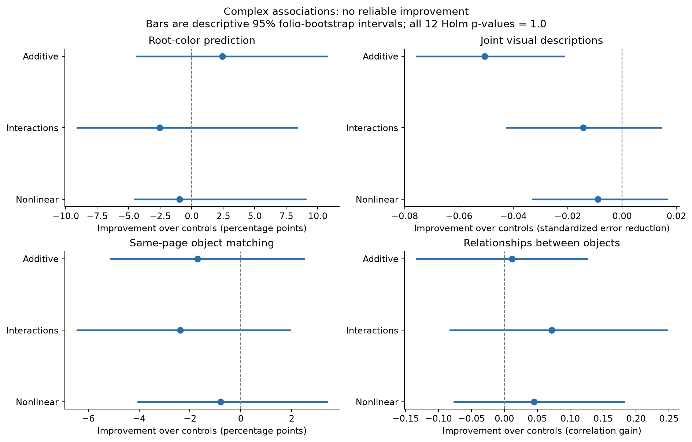
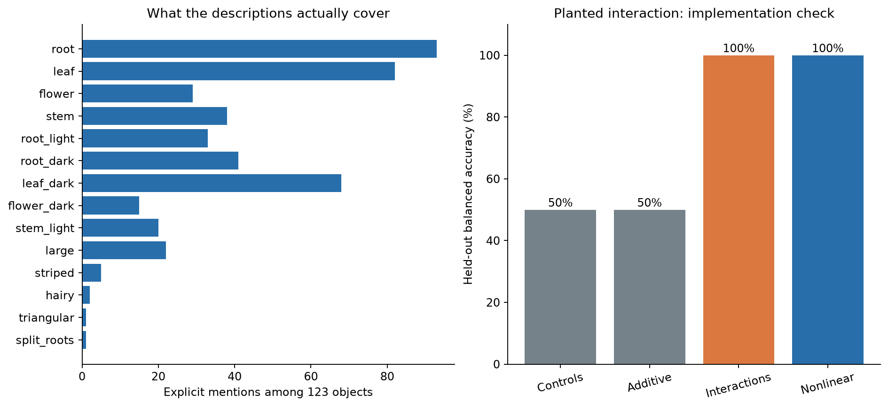

# Beyond root color: complex text–image associations

This extends the image-description pilot to joint features, nonlinear models, object
matching, and relationships between objects. None of the 12 planned comparisons
establishes a text–image association on this dataset.

**Joint profile:** a vector of explicit visual mentions and their pairwise combinations;
for example, light roots together with dark leaves. Zero means not mentioned, not absent.
**Interaction model:** one that can use combinations of text features whose individual
contributions are insufficient; the synthetic check plants exactly this situation.
**Same-page matching:** ranking the correct visual description among alternatives on
that held-out page; ties receive half credit and chance normalized rank is 50%.
**Holm correction:** adjusts the 12 planned tests together, so trying more models or
outcomes does not create an easy route to a positive claim.

```text
Preserve the original single-endpoint result
Audit richer descriptions without scoring text associations
Freeze vocabulary, models, grouped evaluation, and 12 tests
Hold out an entire folio and fit only on the remaining folios
Predict joint profiles and compare same-page matches and object relationships
Shuffle complete annotation profiles within pages 999 times and refit
Correct all 12 tests; preserve every result
```

## What was done

- Expanded from 59 root-color examples to **123 whole-plant descriptions** on six folios;
  121 objects have at least two alternative descriptions on the same page.
- Encoded 35 base descriptors and all 595 pairwise co-mentions. Depending on the held-out
  folio, 58–70 dimensions have sufficient training support to enter the joint-profile model.
- Compared additive, pair-interaction, and nonlinear radial text kernels against nonlinear
  length/layout controls, with all sides and panels of each folio held out together.
- Tested root color, joint-description prediction, same-page matching, and relational
  alignment. No model or metric was selected after seeing the outcomes.
- Checked implementation on a planted interaction: nonlinear models recover it, while
  the additive model and controls remain at chance.

## Why it was done

A single visual attribute can miss a relationship carried by combinations of plant
parts or text features. Joint prediction and within-page matching test those richer
possibilities while reducing the opportunity to exploit page identity or layout.

## Results



All values below use held-out physical folios. Profile error is lower-is-better;
the other three scores are higher-is-better. The control model is stronger than the
previous pilot's linear baseline, so its score is different.

| Model | Root-color balanced accuracy | Joint-profile error | Same-page matching rank | Relational alignment |
|---|---:|---:|---:|---:|
| Length/layout controls | 61.28% | 0.9565 | 54.65% | 0.0140 |
| Additive | 63.72% | 1.0070 | 52.95% | 0.0256 |
| Interactions | 58.74% | 0.9708 | 52.28% | 0.0859 |
| Nonlinear | 60.30% | 0.9655 | 53.85% | 0.0594 |

1. **Joint visual features did not improve recovery.** All three text models increase
   profile error relative to controls. These targets include combinations such as root
   color plus leaf color, size plus part, and multiple co-mentioned structures. They
   predict descriptions, not biological presence/absence or translated words.
2. **Same-page matching did not improve.** Text models score 52.28–53.85% normalized
   rank versus 54.65% for controls. These are rank scores, not percentages of objects
   identified exactly. Keeping candidates on the same page removes a simple route to
   success through section, scribe, or page differences.
3. **Relational alignment had the largest apparent improvement.** The interaction
   model improves correlation by 0.0719, with interval [−0.0821, +0.2466] and raw p=0.153.
   This interval crosses zero; even before correcting for multiple comparisons, it does
   not meet the declared gate. All twelve corrected p-values are 1.000.
4. **The nonlinear implementation check passed.** On 24 synthetic observations in six
   held-out groups, the interaction and radial models reach 100% balanced accuracy,
   p=0.001 each. Additive and control models score 50%. This demonstrates detection of
   that planted pattern; it does not establish adequate power for every Voynich relation.



The negative outcome covers a wider set of tests than the original root-color pilot.
It does not rule out more complex relations in the manuscript. The data barely represent
some desired features: triangular shape has one clear mention, hairy/fuzzy two, split
roots one, and stripes five. A larger model cannot supply the missing annotations.

## Full comparison record

Gains for root color and matching are percentage points. Profile gains are standardized
mean-square-error reductions; relational gains are correlations. Intervals are paired
2,000-draw folio bootstraps, descriptive rather than simultaneous confidence intervals.
Permutation tests move entire profiles together, preserving co-mentions and page totals.

| Endpoint | Model | Gain over controls | 95% folio interval | Raw p | Holm p |
|---|---|---:|---|---:|---:|
| Root-color prediction | Additive | +2.4306 | [-4.3478, +10.7143] | 0.350 | 1.000 |
| Root-color prediction | Interactions | -2.5463 | [-9.0909, +8.3333] | 0.653 | 1.000 |
| Root-color prediction | Nonlinear | -0.9838 | [-4.5455, +9.0385] | 0.559 | 1.000 |
| Joint visual descriptions | Additive | -0.0505 | [-0.0754, -0.0215] | 0.438 | 1.000 |
| Joint visual descriptions | Interactions | -0.0143 | [-0.0424, +0.0144] | 0.584 | 1.000 |
| Joint visual descriptions | Nonlinear | -0.0090 | [-0.0329, +0.0164] | 0.509 | 1.000 |
| Same-page object matching | Additive | -1.7025 | [-5.0996, +2.4735] | 0.698 | 1.000 |
| Same-page object matching | Interactions | -2.3751 | [-6.4352, +1.9274] | 0.806 | 1.000 |
| Same-page object matching | Nonlinear | -0.7989 | [-4.0378, +3.3816] | 0.599 | 1.000 |
| Relationships between objects | Additive | +0.0116 | [-0.1326, +0.1254] | 0.416 | 1.000 |
| Relationships between objects | Interactions | +0.0719 | [-0.0821, +0.2466] | 0.153 | 1.000 |
| Relationships between objects | Nonlinear | +0.0454 | [-0.0763, +0.1823] | 0.220 | 1.000 |

## Method and limits

1. **Visual representation.** Fixed botanical vocabulary over clear clauses in existing
   descriptions, with uncertain/editorial clauses excluded. Pairwise co-mentions are
   targets, not independently observed new objects. At least three mentions and three
   non-mentions in the training fold are required for a dimension. This grammar is a
   limited annotation parser, not a new independent visual assessment. Some descriptions
   omit parts or use wording it does not recognize.
2. **Text and controls.** EVA character 1–4-grams plus skip-bigrams, hashed to 512 bins.
   Controls include label length, word count, relative label index, location group,
   and transcriber. All objects share section and inherited hand label 1. Control
   scaling, radial bandwidths, target support, and target scaling fit training folios
   only. Ridge penalty 1 and every model choice were frozen before scoring.
3. **Inference.** Six physical folios remain a small sample; folio 99 has only two
   eligible plants and no same-page matching trial. Within-page permutations preserve
   the page composition, not every possible confound. Profile support/scales are
   invariant under these permutations because entire pages belong to one fold; cached
   operators therefore refit the specified ridge model exactly. Repeated objects and
   duplicated descriptions are not independent evidence; rank ties get half credit.
4. **Scope.** This is an exploratory reuse of a previously examined catalogue, not a
   new independent confirmation sample. The original annotators could see the writing.
   Targets are human descriptions of images, **not raw-image features**. No species,
   medical use, word translation, or direction of causation has been established.

The full analysis took 8.45 seconds on CPU. No GPU rental, model download,
or additional prediction/BPC experiment was used. The original Voynich final test
remains sealed. Original pilot and recovery protocols/results are unchanged.

## Next evidence to collect

The useful next extension is a larger **blinded visual-feature dataset**, rather than
more fits to these same descriptions. Annotate consistent image regions with writing
hidden: root branching/count, leaf arrangement and shape, flower structure, texture,
color distribution, and spatial relations. Distinguish present, absent, uncertain, and
unobservable. Use two independent annotators, record agreement, and reserve whole folios
before fitting. A raw-image embedding can then be another declared representation,
with text masking and same-page retrieval controls to prevent reading the glyphs.
This annotation/pixel study has not yet been performed.

## Audit and reproduction

- [Frozen protocol](PROTOCOL.md), [code/source hashes and coverage audit](freeze.json),
  [all metrics, null draws, and per-folio results](results.json), [verification](verification.json).
- Code: `voynich/association_complex.py`, `experiments/association_complex.py`;
  report renderer: `experiments/association_complex_report.py`.
- Source: [Grove/Stolfi 1998 catalogue](https://www.ic.unicamp.br/~stolfi/EXPORT/voynich/98-02-01-lotsa-labels/).
  Raw annotations remain local; no explicit source reuse license was found. Aggregate
  results and source attribution are stored here.
- Run order in a fresh isolated output archive: `python -m experiments.association_complex freeze`,
  then `run`. Existing output is protected against overwrite. `verify` checks all frozen
  hashes; `python -m experiments.association_complex_report` regenerates these graphs
  from saved scores. Original local predictions remain in `artifacts/association-complex/`.
