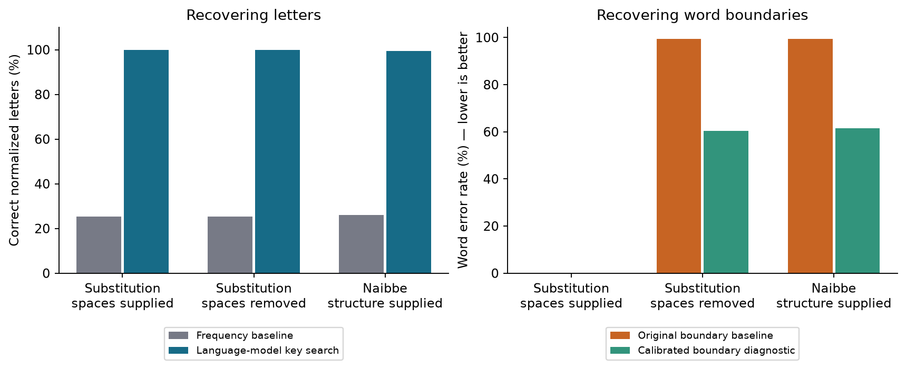

# Controlled decipherment: recovering Italian content

A blind solver recovered normalized Italian from synthetic ciphertext without receiving the true letter key or paired original passages.

It recovered every letter and word when original spaces were supplied. Removing the spaces made word recovery much harder, even when the letter sequence was correct. This is a controlled positive result for decipherment, not a Voynich translation.

**Plaintext:** the original readable passage. **Blind:** the solver receives no answer/key file.
**Word error rate:** substitutions, deletions, and insertions divided by reference word count; lower is better.

```text
Fit character frequencies on unrelated modern Italian training text
Encrypt six Dante passages under two hidden random letter keys each
Attempt each passage/key with spaces, without spaces, and through Naibbe
Freeze predictions before opening the evaluator's originals
Score recovered letters and words
Keep the original failure record when testing a later boundary repair
```

## What was done

- Ran 36 recovery cases: six nonoverlapping Dante passages, two keys, and three conditions.
- Trained a four-character frequency model on modern Italian ISDT training text; no LLM or paired cipher/original training examples were used.
- Used seeded simulated annealing to search a substitution key: six restarts × 12,000 proposals per case. Frequency-only decoding is the baseline.
- Generated hidden keys independently with system randomness and stored them only in the evaluator directory. Solver inputs and predictions are hashed.
- Used local CPU computation; the Voynich model suite retained exclusive use of the Apple GPU.

## Results



| Condition | Letter recovery | Frequency-only letters | Original word error rate | Calibrated boundary error rate (secondary) |
|---|---:|---:|---:|---:|
| Substitution, spaces supplied | 100.00% | 25.30% | 0.00% | 0.00% |
| Substitution, spaces removed | 100.00% | 25.30% | 99.32% | 60.33% |
| Naibbe, structure supplied | 99.44% | 25.97% | 99.32% | 61.53% |

Scores pool characters or words across cases. The independent source material is six passages from one work; keys and conditions reuse them. Thirty-six cases are not thirty-six independent texts.

1. **A verified positive control.** With original spaces, the search recovered all normalized letters and words on these passages. The unrelated Italian character model supplies constraints strong enough to infer the hidden letter mapping for this known cipher family.
2. **Letters are not complete text recovery.** Without spaces, the letters were still recovered exactly, but the original word splitter produced roughly 99% word error. Its unknown-word penalty favored long merged strings. That failure remains in the frozen primary results.
3. **A transparent secondary repair.** After observing that failure, a separate diagnostic selected an unknown-word penalty on 100 modern Italian development sentences, then froze new segmentations before grading the Dante passages. It reduced error to about 60–62%, still poor. This is exploratory reuse of the benchmark, not a fresh confirmatory result. Vocabulary, spelling, and the simple boundary model are possible sources of the remaining errors; their effects are not isolated.

## What the Naibbe condition supplies

The [published Naibbe implementation](https://github.com/greshko/naibbe-cipher/tree/f2675ec5dd275268bc64dd48ea64fc0e0e9827a2) encodes one- or two-letter groups into longer glyph strings and introduces artificial token boundaries. We used its 52-card configuration and ambiguity-avoidance setting, with no extra deletion of ciphertext spaces. Original word spaces are removed. A hidden global permutation changes the plaintext-letter assignments.

The solver receives the published structural codebook and cipher family. It first converts glyph groups to latent cipher letters, choosing a fixed lexical tie-break for ambiguous parses, then searches the unknown global letter key. This is substantially easier than discovering an unknown homophonic cipher from scratch. The remaining letter errors are consistent with this unresolved parse ambiguity. We do not infer that Voynich uses Naibbe.

The encoder records a private trace. Each generated chunk was verified to be among the public decoder's candidates, and reversing the true letter key reproduced the normalized source letters. That check does not assert every glyph parse is unique or restore original word spaces.

## Example

First normalized original / correctly recovered spaced case:

> nel mezzo del cammin di nostra vita mi ritrovai per una selva oscura

The original space-free boundary baseline instead began:

> nelmezzodelcammindinostr avitamiritrovaiperunasel vaoscuracheladirittaviae

The symbols can be correct while the proposed words are wrong. Evaluation must keep those outcomes separate.

## Meaning, supervision, and limitations

- Source language (Italian), normalization, alphabet, and cipher family are supplied. These advantages are not established for Voynich.
- Accents, case, punctuation, and some spelling distinctions are removed: j→i, k→c, w→uu. Scores concern this declared normalized representation.
- Dante is held out from the modern Italian frequency-model corpus. The solver is a frequency model fitted here, not a pretrained LLM that might have memorized the work.
- No direct semantic question answering, source-language discovery, English rendering, or Voynich word mapping has been demonstrated.
- The next useful recovery test should improve word segmentation with independent validation and fresh evaluation passages, then reduce the supplied cipher-structure assumptions.

## Reproduction and provenance

```sh
.venv/bin/python -m experiments.decipherment prepare
.venv/bin/python -m experiments.decipherment solve
.venv/bin/python -m experiments.decipherment evaluate
.venv/bin/python -m experiments.boundaries
python -m experiments.discovery_report
```

Preparation and solving refuse existing benchmark outputs. The evaluator-only directory is separated from solver inputs; this is audited software input separation, not an OS sandbox. The blind solver does not open evaluator answers. The Voynich final test remains untouched.

- [Fixed benchmark plan](plan.json)
- [Primary results and recovered passages](results.json)
- [Secondary boundary calibration and errors](boundary-diagnostic.json)
- [Pinned Naibbe sources](../decipherment-sources.json)
- [Pinned UD sources](../language-sources.json)
- Original/hidden keys: `artifacts/decipherment/evaluator-only/answers.json`.
- Frozen public solver inputs and predictions: `artifacts/decipherment/public/` and `predictions.json`.
- [Overall goal and research history](../../RESEARCH_LOG.md)

Naibbe attribution: Michael A. Greshko (2025), [The Naibbe cipher](https://doi.org/10.1080/01611194.2025.2566408); modified MIT license retained with the pinned source. Italian-Old/Dante and Italian-ISDT sources are credited in the source manifest. Italian-Old is CC BY-SA 4.0; Italian-ISDT is CC BY-NC-SA 3.0. Preserve the respective source terms and attribution when redistributing derived material. [Italian-Old corpus description](https://universaldependencies.org/treebanks/it_old/index.html)
