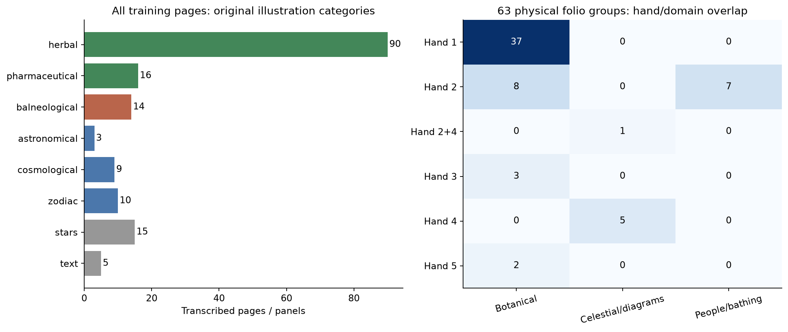
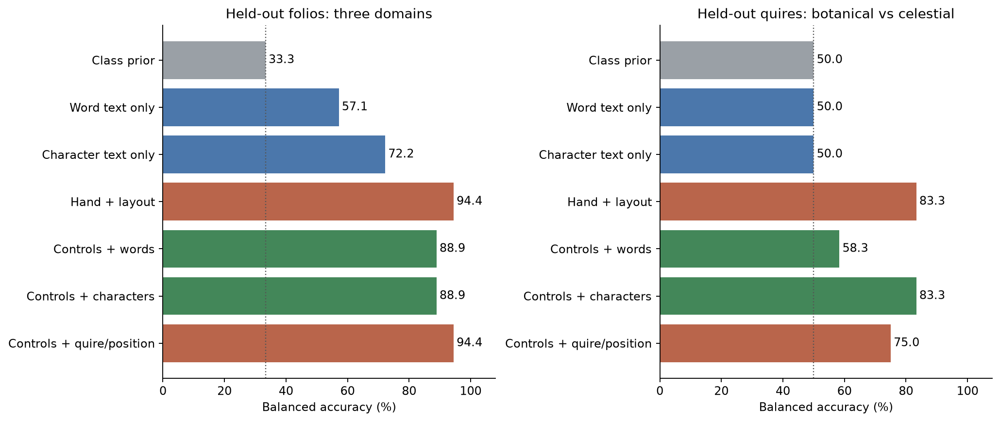
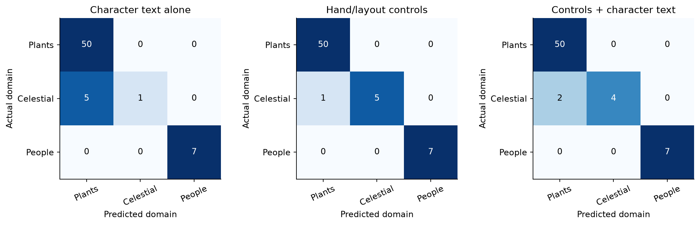

# Broad image domains: plants, people, and celestial diagrams

The earlier image studies considered plant/root annotations only. This study instead
uses broad illustration domains across the manuscript's existing training folios.
Text varies with domain, but this experiment does not establish a contribution beyond
hand/layout controls or an interpretation of the words.

**Domain:** a conventional dominant illustration category, not a decoded text topic.
**Folio:** a physical manuscript leaf; sides/panels stay together, with the Rosettes
foldout treated as one 85–86 group.
**Balanced accuracy:** average recall across domains; botanical dominance cannot make
an always-botanical classifier look successful on this metric.
**Confound:** a shared difference that can explain a prediction; here scribal hand and
quire membership are tightly associated with the visual categories.

```text
Take existing illustration-type metadata, independently of the unread words
Keep only the original training folios and all their usable text types
Group sides/panels by physical folio
Freeze domain mapping, features, controls, and tests
Predict unseen folios and, where supported, unseen quires
Compare text with hand/layout controls and audit untestable confounds
```

## What was done

- Audited all eight original illustration categories on 162 training pages/panels.
- Compared botanical, people/bathing, and celestial/diagram domains: 142 pages/panels
  collapsed into **63 physical folio groups** (50 botanical, 7 people/bathing, 6 celestial).
- Included short labels and circular text as well as paragraphs. Earlier paragraph-only
  prepared documents omitted text from some diagram pages.
- Tested word-frequency and character-pattern models against hand/layout controls,
  plus a stricter quire/position baseline. All model inputs and comparisons were frozen.
- Preserved the previous plant studies and kept validation/final-test folios outside
  this experiment. No paid compute or pretrained model was used.

## Why it was done

A plant-part comparison cannot test whether text differs between botanical, human,
and celestial imagery. Broad domains are a distinct question and provide more varied
visual contexts, although manuscript organization makes semantic interpretation difficult.

## Coverage and taxonomy



| Original category | Training pages/panels | Physical folio groups |
|---|---:|---:|
| herbal | 90 | 44 |
| pharmaceutical | 16 | 6 |
| balneological | 14 | 7 |
| astronomical | 3 | 1 |
| cosmological | 9 | 4 |
| zodiac | 10 | 3 |
| stars | 15 | 8 |
| text | 5 | 3 |

The broad mapping combines herbal and pharmaceutical pages as botanical; the latter
also contain containers. Balneological pages form people/bathing. Astronomical,
cosmological, and zodiac pages form celestial/diagrams. This is a dominant-domain label,
not an assertion that those images contain no humans, animals, or plants. Zodiac drawings
also contain human figures. Marginal-star text and text-only pages remain in the coverage
audit but are excluded from these three illustrated domains. Counts by original category
can share folios; the three-domain analysis uses each physical group once.

The label definitions come from the transcription's existing IVTFF illustration field,
not this model's judgment of the writing or new inspection of image pixels.
Sources: [IVTFF specification, §4.3](https://www.voynich.nu/software/ivtt/IVTFF_format.pdf)
and [illustration overview](https://www.voynich.nu/illustr.html).

## What the text can predict



| Model | Held-out-folio balanced accuracy | Held-out-folio raw accuracy | Held-out-quire balanced accuracy |
|---|---:|---:|---:|
| Class prior | 33.33% | 79.37% | 50.00% |
| Word text only | 57.14% | 87.30% | 50.00% |
| Character text only | 72.22% | 92.06% | 50.00% |
| Hand + layout | 94.44% | 98.41% | 83.33% |
| Controls + words | 88.89% | 96.83% | 58.33% |
| Controls + characters | 88.89% | 96.83% | 83.33% |
| Controls + quire/position | 94.44% | 98.41% | 75.00% |

1. **Text-only patterns correlate with domain.** Character patterns achieve 72.22%
   balanced accuracy against the 33.33% class-prior comparator. This is descriptive
   evidence that these texts are distinguishable under this model; no separate
   significance test was registered for that text-only comparison. Raw accuracy is
   misleading here: always choosing botanical already gives 79.37%.
2. **Nuisance features do better.** Hand/layout controls achieve 94.44% balanced
   accuracy (62/63 folios correct). Adding either text representation reduces it to
   88.89% (61/63). These models do not demonstrate extra domain information beyond
   those controls. That does not establish that the text lacks domain information.
3. **Cross-quire transfer is narrower.** Only botanical and celestial domains have
   enough independent quires. People/bathing occurs in a single quire and cannot be
   evaluated for cross-quire transfer here. On 56 folios in 15 quires, hand/layout scores
   83.33%; adding character text ties it, adding words scores 58.33%, and text alone
   scores 50% balanced accuracy. These results must not be compared as if they were
   the same three-class task as the folio experiment.
4. **Semantic independence remains unresolved.** Only 15 folios can exchange domains
   within the same hand signature: eight botanical and seven people/bathing under
   hand label 2. Celestial folios have hand 4 or mixed 2+4; the botanical/celestial
   cross-quire comparison has no label exchanges after conditioning on hand. Conditioning
   further on quire leaves no exchangeable domain labels anywhere. These tests are
   unidentifiable, not evidence against an image–text relationship.



## Controlled comparisons and uncertainty

Positive gain would favor adding text to the hand/layout model. The two identifiable
comparisons used 999 whole-folio permutations within hand strata. Four planned tests
share Holm correction; unidentifiable tests reserve a correction slot but receive no
reported p-value. Intervals use 2,000 paired bootstrap draws, over folios or held-out
quires as appropriate; draws missing a class are omitted and counted in `results.json`.

| Comparison | Gain | 95% bootstrap interval (points) | Raw p | Holm p |
|---|---:|---|---:|---:|
| folio/words | -5.56 points | [-18.56, +0.00] | 0.256 | 1.000 |
| folio/characters | -5.56 points | [-19.05, +0.00] | 0.556 | 1.000 |
| quire/words | -25.00 points | [-50.00, -5.00] | not identifiable | not applicable |
| quire/characters | +0.00 points | [+0.00, +0.00] | not identifiable | not applicable |

The hand-conditioned null preserves inherited hand/domain totals; it does not perfectly
condition on every layout measurement. The analysis is exploratory and depends on that
exchangeability assumption. Neither corrected folio test passes the declared gate.
The cross-quire conditional tests are not identifiable. A high classifier score alone
cannot tell whether a word denotes a plant, person, star, or something else.

## Method, checks, and limits

1. **Representations.** Within-form character 1–4-grams and word frequencies are separate
   2,048-bin hashed views. Log counts, training-fold IDF, and L2 normalization precede
   a squared-cosine kernel. No character n-gram crosses word or page boundaries.
   Raw annotations, page identifiers, and domain labels are excluded from text features.
2. **Controls.** Text/page/locus counts, mean/SD written-form length, locus-type proportions,
   unreadable-form fraction, and inherited hand proportions. Controls use a radial kernel;
   their scaling and bandwidth fit training folds only. A second control includes quire
   identity and folio position. No text-derived Currier class is treated as independent
   evidence. Centered kernel ridge uses penalty 1; no model was tuned on these outcomes.
3. **Validation.** The synthetic domain check uses three vocabularies with matched hand
   and layout. Both text models recover all 18 held-out labels. Its uninformative control
   gets 0% because leave-one-out training leaves the true class with one fewer example
   and the prior favors another class; this artifact is recorded, not called chance.
   Tests also check reserved-folio filtering before normalization, annotation removal,
   word boundaries, Rosettes grouping, fold isolation, and grouped permutations.
4. **Limits.** Only six celestial and seven human/bathing folio groups are available.
   All categories use one transcription and conventional image labels; no independent
   visual reannotation was performed. These dominant categories are not a multilabel
   inventory of all objects on a page. Readability and retained locus types can differ
   by domain. Folio-bootstrap intervals do not capture every source of within-quire
   dependence; the cross-quire analysis covers a narrower task. This is an
   association/identifiability experiment, not translation.

Runtime: 2.17 seconds on CPU. No new BPC experiment, GPU rental, or model
download. The original final-test folios remain sealed.

## Next meaning-oriented comparison

Use independently annotated **co-occurring object types within the same visual domain**:
people and stars within zodiac diagrams, plant parts and containers within pharmaceutical
pages, human figures and pipes/pools within biological pages. Each annotation needs
explicit present/absent/unknown status and a defined text–image region link. Mask writing
when annotating pixels. Match hand, quire, and layout, reserve new physical groups, then
test whether nearby labels track those objects. This tests a stronger semantic connection
than recognizing which illustrated section a folio belongs to. It has not yet been run.

Audit: [frozen protocol](PROTOCOL.md), [input hashes and pre-score coverage](freeze.json),
[all scores, per-folio predictions, and null distributions](results.json),
[verification](verification.json).
Reproduce in an isolated output archive with `python -m experiments.image_domains freeze`
then `run`; existing outputs are protected. `verify` checks hashes. Regenerate this report
with `python -m experiments.image_domains_report` (matplotlib required).
