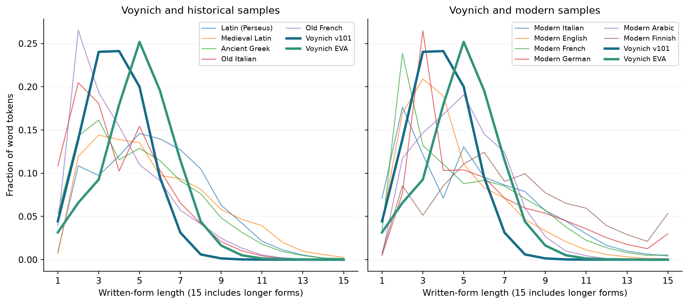
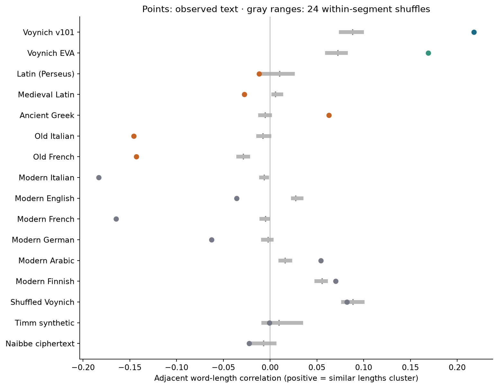
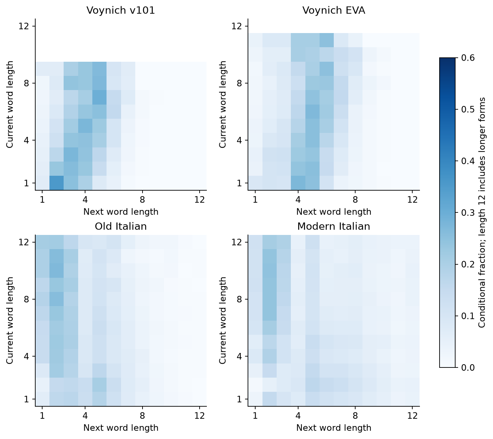
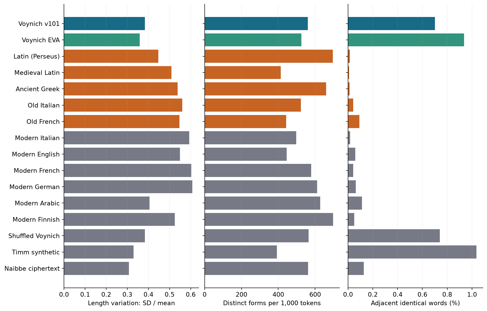

# Voynich versus historical and modern language samples

This study compares written-form statistics. It does not identify Voynich's language.

Voynich's length distribution is relatively narrow, and neighboring lengths cluster more strongly than in these eleven language samples. Transcription, boundaries, layout, genre, and sample selection all affect the comparison.

**Word:** a written form under the stated boundary rule, not a proven linguistic word in Voynich.
**Length:** transcription symbols for Voynich; Unicode letters, excluding diacritics and internal punctuation, for other texts.
**Correlation:** positive values mean long forms tend to neighbor long forms and short forms short forms.

## Scope and method

```text
Use Voynich training pages only
Read pinned UD 2.18 training corpora as surface text
Count written forms and their lengths
Compare adjacency within manuscript lines or corpus sentences
Shuffle forms within those same segments to check the effect of order
Compare vocabulary diversity in equal 1,000-token windows
```

The main Voynich counts describe **148 training paragraph pages**, not the whole manuscript. Final-test pages are excluded. GC/v101 contains 25,723 usable forms; 45 forms with uncertain glyphs are excluded and break adjacency. The EVA version has 24,147 usable forms on the same count of training pages, with 520 uncertain forms excluded. The transcriptions differ in readings and boundaries.

Known-language words are extracted from surface text, preserving internal apostrophes and hyphens. Letter counts omit those punctuation marks and combining diacritics. Case is lowered. CoNLL-U surface-token ranges and spacing are respected when reconstructing missing text; syntactic clitic splits are not treated as written spaces. [UD format documentation](https://universaldependencies.org/format.html)

## Word counts and lengths



| Sample | Word tokens | Distinct forms | Mean length | SD | Adjacent-length correlation |
|---|---:|---:|---:|---:|---:|
| Voynich v101 | 25,723 | 6,645 | 3.865 | 1.479 | +0.218 |
| Voynich EVA | 24,147 | 5,398 | 4.975 | 1.784 | +0.169 |
| Latin (Perseus) | 15,429 | 6,730 | 5.775 | 2.576 | -0.012 |
| Medieval Latin | 335,594 | 18,181 | 5.717 | 2.912 | -0.027 |
| Ancient Greek | 139,611 | 33,069 | 5.039 | 2.710 | +0.063 |
| Old Italian | 79,722 | 11,633 | 4.029 | 2.259 | -0.146 |
| Old French | 155,541 | 17,400 | 4.064 | 2.223 | -0.143 |
| Modern Italian | 216,586 | 27,136 | 5.307 | 3.150 | -0.183 |
| Modern English | 175,165 | 15,983 | 4.475 | 2.460 | -0.036 |
| Modern French | 283,075 | 39,873 | 5.070 | 3.059 | -0.165 |
| Modern German | 218,055 | 45,983 | 5.987 | 3.640 | -0.063 |
| Modern Arabic | 169,889 | 30,773 | 4.934 | 1.998 | +0.054 |
| Modern Finnish | 135,951 | 44,698 | 7.473 | 3.919 | +0.070 |
| Shuffled Voynich | 25,723 | 6,645 | 3.865 | 1.479 | +0.082 |
| Timm synthetic | 7,600 | 1,711 | 4.699 | 1.548 | -0.001 |
| Naibbe ciphertext | 14,790 | 3,904 | 5.296 | 1.626 | -0.022 |

Counts are corpus sizes, not estimates of the size or vocabulary of a language. Raw distinct-form counts depend on sample size; use the equal-size window measure below.

1. **Transcription changes the answer.** Mean Voynich length is 3.865 in v101 and 4.975 in EVA. Old Italian is 4.029 and modern Italian 5.307 in these samples. Selecting a language by the nearest average would therefore be misleading; encoding units and genre already change the apparent resemblance.
2. **Length is comparatively concentrated.** The v101 SD is 1.479, EVA 1.784, and modern Arabic 1.998; the other language samples are broader in absolute character units. The synthetic controls are also narrow (Timm 1.548; Naibbe 1.626), so narrowness does not determine whether a text has meaning.

## Word-length adjacency





Heatmap rows with fewer than 20 observed pairs are blank; this avoids highlighting single rare words. The full count matrices remain in the numerical results.

1. **Similar lengths cluster.** v101 has adjacent-length correlation +0.218; EVA +0.169. Old Italian is −0.146 and modern Italian −0.183; Ancient Greek, Arabic, and Finnish have small positive values.
2. **Line composition explains part of it.** Shuffling within Voynich lines gives mean correlations around +0.088 (v101) and +0.072 (EVA). Observed excesses are +0.130 and +0.097. These measure order beyond the segment's collection of word lengths, not syntax. Line-position rules, copying, and transcription choices remain possible explanations.
3. **Segment definitions matter.** Manuscript lines are not known sentences. A sensitivity check uses nonoverlapping 10-word blocks within longer segments: v101 +0.225 and EVA +0.187. It retains only sufficiently long segments and does not make genres or layouts equivalent. Shuffle ranges describe these 24 permutations, not population confidence intervals.

## Vocabulary, repetition, and predictability



| Sample | Types / 1,000 tokens | Immediate repeat % | One-edit neighbor % | Within-word next-character entropy (bits) |
|---|---:|---:|---:|---:|
| Voynich v101 | 559.9 | 0.701 | 4.400 | 2.616 |
| Voynich EVA | 525.5 | 0.936 | 3.399 | 2.075 |
| Latin (Perseus) | 695.4 | 0.014 | 0.106 | 3.197 |
| Medieval Latin | 413.0 | 0.010 | 0.304 | 3.092 |
| Ancient Greek | 659.5 | 0.013 | 0.875 | 3.378 |
| Old Italian | 522.6 | 0.042 | 1.852 | 2.977 |
| Old French | 442.1 | 0.092 | 1.741 | 2.925 |
| Modern Italian | 496.8 | 0.016 | 0.675 | 3.095 |
| Modern English | 445.4 | 0.058 | 0.985 | 3.315 |
| Modern French | 578.9 | 0.042 | 1.001 | 3.169 |
| Modern German | 610.6 | 0.063 | 0.344 | 3.202 |
| Modern Arabic | 628.1 | 0.112 | 0.281 | 3.831 |
| Modern Finnish | 697.0 | 0.049 | 0.231 | 3.227 |
| Shuffled Voynich | 564.8 | 0.741 | 4.077 | 2.616 |
| Timm synthetic | 392.2 | 1.036 | 4.942 | 1.890 |
| Naibbe ciphertext | 561.2 | 0.128 | 1.142 | 2.008 |

Vocabulary diversity averages 32 seeded, contiguous 1,000-token windows. Windows may overlap; they are a size control, not independent replicates. One-edit neighbors differ by exactly one symbol insertion, deletion, or substitution; identical pairs are counted separately.

Voynich repeats and near-copies adjacent forms more often than the language samples, but the shuffled and Timm controls also do so. The v101 immediate-repeat rate is 0.701%, versus 0.741% in the fixed within-line shuffle. Repetition within lines does not itself establish meaningful word order.

Character entropy is a descriptive frequency calculation within words, not held-out model performance. It depends strongly on the transcription alphabet and word boundaries: EVA gives 2.08 bits, v101 2.62. Do not compare it directly with the model BPC in earlier reports.

## Voynich sensitivity checks

| Variant | Tokens | Mean length | Adjacent-length correlation | Excess above shuffled segment |
|---|---:|---:|---:|---:|
| Voynich v101 | 25,723 | 3.865 | +0.218 | +0.130 |
| Voynich v101 A | 7,959 | 3.698 | +0.132 | +0.073 |
| Voynich v101 B | 17,387 | 3.943 | +0.247 | +0.155 |
| Voynich, uncertain spaces merged | 24,213 | 4.106 | +0.189 | +0.100 |
| Voynich EVA | 24,147 | 4.975 | +0.169 | +0.097 |

The A/B rows exclude other or unknown variety labels and need not sum to the whole sample. Merging uncertain spaces changes the mean but preserves a positive adjacency excess in this sample.

## What this means for translation

A candidate encoding must explain boundaries, narrow written-form lengths, local length clustering, and frequent related forms together. These constraints can reject an overly simple account, but they cannot select a source language from a resemblance ranking. A letter-for-letter substitution preserving spaces preserves the source word lengths; Naibbe's artificial spacing does not. Our [controlled decipherment benchmark](../decipherment/REPORT.md) tests recoverable content separately.

## Sources and limitations

Pinned [UD 2.18](https://universaldependencies.org/download.html) corpora are samples, not language-wide distributions. Ancient literature, medieval poetry/theology/legal text, and modern news/web text are not genre matched. Corpus/topic effects, orthography, and morphological structure are confounded. No source-language probabilities, universal rankings, or causal historical changes are inferred.

| Sample | Repository | Recorded genre | License |
|---|---|---|---|
| Latin (Perseus) | [UD_Latin-Perseus](https://github.com/UniversalDependencies/UD_Latin-Perseus/tree/a296f012949ef766ffdc5898ded59ffe0a7c3c6a) | fiction nonfiction bible | CC BY-NC-SA 2.5 |
| Medieval Latin | [UD_Latin-ITTB](https://github.com/UniversalDependencies/UD_Latin-ITTB/tree/50140a44dcf8c54dbca3a2be59f62c2a519057f2) | nonfiction | CC BY-NC-SA 3.0 |
| Ancient Greek | [UD_Ancient_Greek-Perseus](https://github.com/UniversalDependencies/UD_Ancient_Greek-Perseus/tree/37837c7a3c592c9563f8c51cc63344b87247f8a5) | fiction | CC BY-NC-SA 2.5 |
| Old Italian | [UD_Italian-Old](https://github.com/UniversalDependencies/UD_Italian-Old/tree/2c1361d621dafa7c465da0947f73765caaf743af) | poetry | CC BY-SA 4.0 |
| Old French | [UD_Old_French-PROFITEROLE](https://github.com/UniversalDependencies/UD_Old_French-PROFITEROLE/tree/669e5aa53d8edd68404151678235d6b4bd5dffe9) | nonfiction legal poetry | CC BY-NC-SA 3.0 |
| Modern Italian | [UD_Italian-ISDT](https://github.com/UniversalDependencies/UD_Italian-ISDT/tree/4852011b996b9ec30d884a7a48e1118d0ce928f6) | legal news wiki | CC BY-NC-SA 3.0 |
| Modern English | [UD_English-EWT](https://github.com/UniversalDependencies/UD_English-EWT/tree/b7711cce01cdd4f5fcc0a8199b8a50d951b16c0c) | blog social reviews email web | CC BY-SA 4.0 |
| Modern French | [UD_French-GSD](https://github.com/UniversalDependencies/UD_French-GSD/tree/15958a5df1d09e2a360784caaed07b9a3fcbf7a8) | blog news reviews wiki | CC BY-SA 4.0 |
| Modern German | [UD_German-GSD](https://github.com/UniversalDependencies/UD_German-GSD/tree/81d8c3612a88f5867fd089e9c0a5466ef230078b) | news reviews wiki | CC BY-SA 4.0 |
| Modern Arabic | [UD_Arabic-PADT](https://github.com/UniversalDependencies/UD_Arabic-PADT/tree/5b1ad7e87c70b0e290f8499b64531c7d6a88eea0) | news | CC BY-NC-SA 3.0 |
| Modern Finnish | [UD_Finnish-TDT](https://github.com/UniversalDependencies/UD_Finnish-TDT/tree/a4966aac577d75ee43887c22b22d9522fb0a9caa) | mixed genres | CC BY-SA 4.0 (see LICENSE.txt) |

Individual source licenses and attribution files are retained under `artifacts/language-sources/`. Latin and Old French sources include noncommercial licenses. The manifest records every downloaded file, immutable revision, hash, and size. Downloads total about 210 MiB, with no model downloads.

- [Full numerical results, histograms, and hashes](results.json)
- [Pinned source manifest](../language-sources.json)
- [Overall research record](../../RESEARCH_LOG.md)

```sh
.venv/bin/python -m experiments.languages
python -m experiments.discovery_report
```
