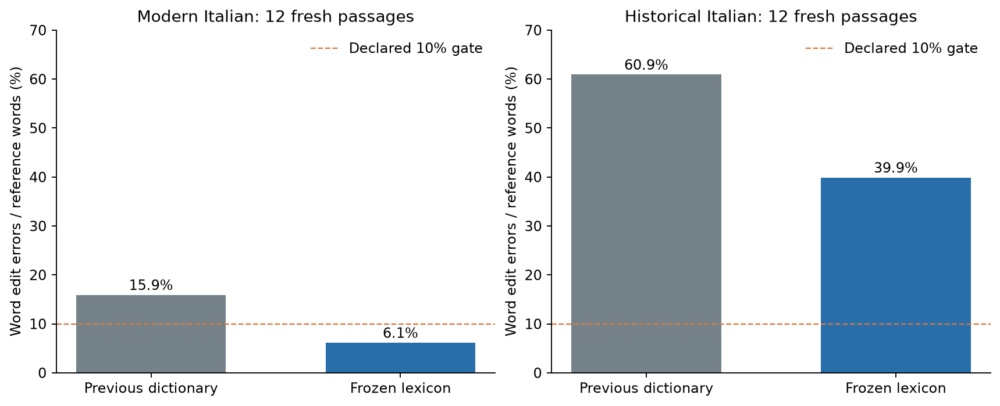
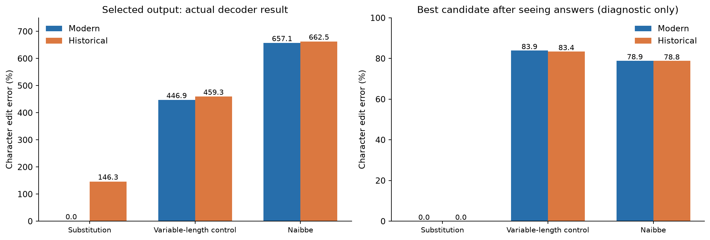
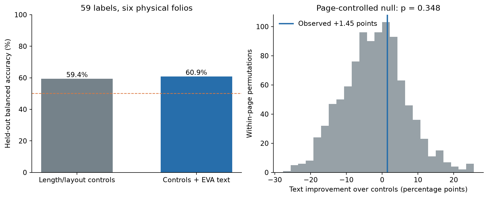

# Decipherment-method benchmark: 21 September 2026

The deliverable is a validated recovery benchmark with positive controls and explicit
Voynich limits. Translation into English or Italian is not supported by current evidence.
Publication suitability is an aim; the current pilot is not a completed decipherment paper.

## What was done

- Deleted Runpod pod `6o8irlwqlzhsb1` and attached temporary volumes. The audit confirms
  deletion; network storage is 0 GB and balance was $8.89 at check. Local results remain.
- Formally closed broad prediction training. The monitor stays paused; no more BPC sweeps,
  longer training, or larger models unless a specific falsifiable mechanism justifies one.
- Froze and evaluated a lexicon segmenter on 24 fresh passages after non-Dante tuning.
- Ran a codebook-free decoder on 12 ciphertexts from four further fresh passages.
- Started the independent-evidence track with existing visual descriptions and controlled,
  held-out-folio tests. Preserved failed endpoints, controls, and inference limits.

## Why it was done

Earlier work improved prediction without validating meaning. These tests measure actual
content recovery and an external visual association, while exposing which supplied hints
and evaluation choices make an apparent success possible.

## 1. Segmentation improved; the historical problem remains



Word error fell from 15.9% to 6.1% on modern Italian and from 60.9% to 39.9% on historical
Italian. Both exceed the declared 20% relative-improvement gate. Historical text fails
our <10% word-error requirement. The 24 fresh passages exclude all previous challenge
sentences; historical passages still come from Dante, so they are not independent authors.

[Method, uncertainty, sources, and gates](../segmentation/REPORT.md).

## 2. Removing the codebook reveals an unvalidated decoder



Modern substitution succeeds at the declared gate (0% letter error, 5.72% pooled word
error). Historical substitution exposes a selection failure: an exact letter candidate
exists, but the language-prior score chooses an incorrect expansion. Naibbe and the broader
variable-length positive control both fail, including the post-hoc best-candidate check.
CER can exceed 100% because the chosen mappings insert many extra characters.

This is a documented negative for this decoder, not a proof that every possible
unknown-cipher method fails. The earlier codebook-assisted Naibbe result does not
establish transfer to Voynich. Search and selection need validation before such a claim.

[Fixed protocol, candidate diagnostics, and detailed results](../codebook-free/REPORT.md).

## 3. Image evidence: implemented pilot, no established association



The Grove/Stolfi root-color descriptions yield 59 labels on six training folios.
Controls score 59.43% balanced accuracy; adding EVA text scores 60.88%. The 1.45-point
gain has p=0.348 under within-page permutations and a folio interval of −6.81 to +20.83
points. It fails the declared gate. The source is useful for starting the study, but
selective descriptions and annotators' access to text limit independence.

[Source audit, controls, uncertainty, and remaining annotation work](../association/REPORT.md).

## Decision and remaining work

```text
Keep the prediction track closed
Preserve these frozen failures and the successful modern control
If continuing, validate decoder selection/search on development controls
Freeze again and reserve entirely new passages before any confirmatory run
Acquire independent visual annotations and a new held-out image sample
Require external evidence before proposing Voynich meanings
```

The next concrete bottleneck is validation of **decoding selection under language-prior
mismatch**, together with a search method that passes variable-length positive controls.
Historical segmentation remains another explicit failure. The larger herbal-page study
needs annotations of images with their text hidden, explicit unknown/absent labels,
annotator agreement, and frozen folio groups. None of these gaps is solved by renting a
larger GPU. No new follow-up computation was launched after viewing the answers.

All new work used CPU, with no new cloud charges from computation or model downloads.
The one-week allocation was a maximum budget, not a required runtime. Final Voynich test
pages remain sealed. The report does not identify any Voynich word or claim a translation.

## Reproduction and provenance

- [Current plan](../METHOD_BENCHMARK_PLAN.md); [central research record](../../RESEARCH_LOG.md).
- [Cloud deletion audit](../cloud-cleanup.json); [verification](verification.json).
- [Commands and artifact requirements](../../README.md#current-benchmark-commands).
- Recheck local frozen inputs and passage exclusions with `python -m experiments.benchmark_verify`.
- Reports regenerate from saved aggregate results with `python -m experiments.benchmark_report`.
  Plots need matplotlib; reports perform no training or test scoring.
- Source hashes, frozen code, configuration grids, per-case metrics, and failed gates are
  stored alongside each report. Raw licensed sources and private references remain
  local. A fresh replication needs an isolated output archive; it is not byte-identical
  because challenge keys are random. Exact regrading needs the preserved local artifacts.
- Existing Qwen/GRU, linguistic-statistics, and codebook-assisted reports remain historical
  records. Their next-step suggestions are superseded by the closed prediction policy.
