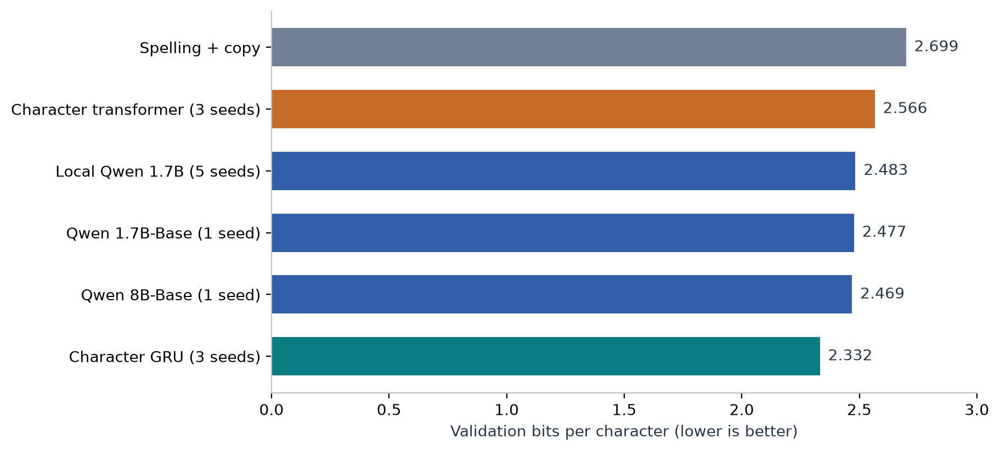
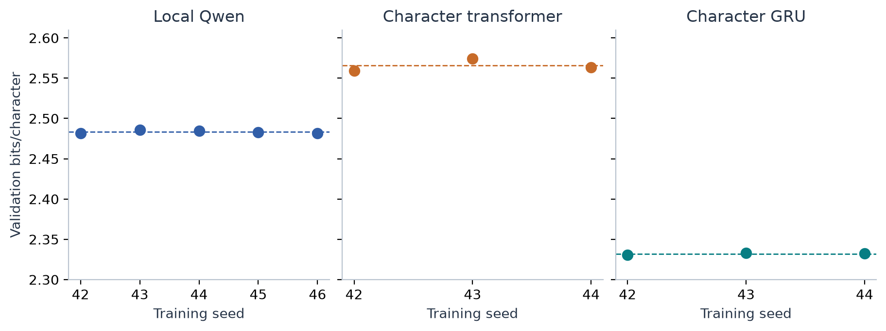
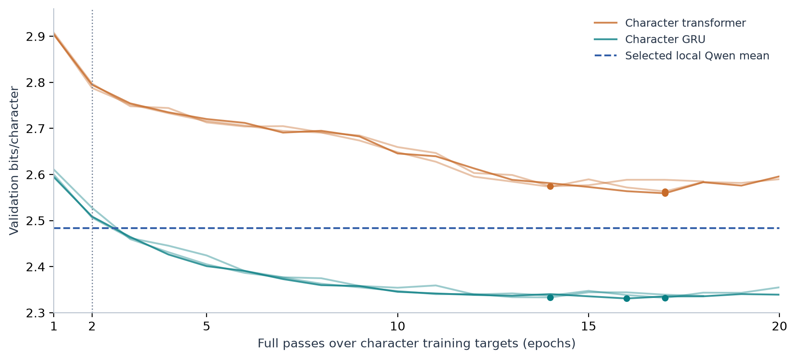
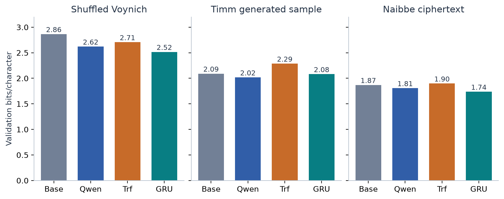
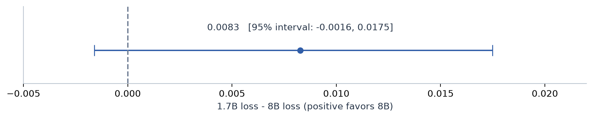

# Voynich: what the completed runs tell us

Completed prediction experiments | Snapshot 2026-09-20T18:07:09+00:00

This study compares prediction of Voynich transcription characters on fixed validation pages.

**Main finding:** a 1.32-million-parameter recurrent model trained from scratch reaches **2.332 bits/character**, ahead of adapted Qwen and the implemented copying baseline.

**Bits/character (BPC):** negative log probability per scored transcription character; lower is better.

**Validation:** pages excluded from weight fitting but reused for selecting settings and checkpoints.



Figure 1. Same 29 GC validation pages and 19,752 scored characters. Bars show seed means where available. Training exposure and model architecture differ; these are practical scores, not translation accuracy.

1. **Completed work.** Five local Qwen seeds, three Qwen controls, two cloud base models, and twelve character-model runs. All selected checkpoints were verified. Final-test scores remain sealed.

2. **Implication.** A model without prior language training can exceed our present Qwen scores. These results establish predictive structure, not word meanings or an English/Italian translation.

## 01 / The result repeats across seeds

Repeated training measures sensitivity to initialization and data order.

**Thesis:** Qwen's gain and the GRU's stronger score are stable across the seeds tested.

**Seed:** controls randomness in initialization and training order. **GRU:** a gated recurrent neural network that updates a hidden state as it reads characters.



Figure 2. Each dot is a separately trained model's selected checkpoint; dashed lines are means. The common vertical scale starts at 2.30 to make differences visible. These are training repeats on the same validation split.

| Model | Seeds | Mean BPC | Seed SD | Range |
| --- | --- | --- | --- | --- |
| Local Qwen | 5 | 2.4833 | 0.0017 | 2.4818-2.4857 |
| Character transformer | 3 | 2.5656 | 0.0079 | 2.5592-2.5744 |
| Character GRU | 3 | 2.3321 | 0.0012 | 2.3309-2.3332 |

1. **Baseline gain.** Local Qwen averages 2.4833 against copy at 2.6985: 8.0% lower loss. This is not an accuracy percentage.

2. **Separate uncertainties.** Seed spread measures training randomness. A folio bootstrap measures variation across manuscript leaves. Neither corrects for repeated validation-based selection.

3. **Layer claims remain unsupported.** Seed-42 random and outer subsets scored 2.4828 and 2.4819. The later repeats hold the outer subset fixed; they do not establish language-specific layers or preserved English/Italian semantics.

## 02 / Training exposure changes the comparison

The character models fit all their weights; Qwen fits only small adapters.

**Thesis:** the GRU wins the practical comparison after more passes, so the result does not isolate the effect of pretraining.

**Epoch:** one pass over all training targets. **Adapter:** trainable changes added to a much larger frozen model.



Figure 3. Character-model validation curves for three seeds. Dots mark selected checkpoints. The Qwen line is its selected five-seed mean, not an epoch-matched trajectory.

1. **Early GRU results.** At epoch 2, GRU loss ranges from 2.506 to 2.528. Selected epochs 14, 16 and 17 yield 2.332 on average. Qwen saw about 2.04 passes over its token-window dataset; epoch 2 is only an approximate exposure reference.

2. **Different inputs.** Character models use context 128 and stride 64 characters. Qwen uses 64 and 32 subword tokens. Both score identical underlying target positions, but their available context is not identical.

3. **Similar trainable counts, different capacity.** GRU has 1,316,608 weights; the character transformer has 1,272,448. Local Qwen trains 1,245,184 adapter parameters on top of about 1.7 billion pretrained weights.

4. **Inference limit.** Prior language training is unnecessary to achieve the observed GRU score on this split. It may still improve data efficiency or other tasks. Neither prediction result establishes decipherment.

## 03 / Controls weaken the meaning claim

Altered and generated texts test alternatives to semantic interpretation.

**Thesis:** neural prediction gains also occur on shuffled or synthetic text, so beating a simple baseline is not a meaning test.

**Control:** a text with known changes or a known construction process, evaluated against its own baseline.



Figure 4. Compare models within each panel, not absolute scores across texts. Base is copy for shuffled/Timm and layout for Naibbe. Trf is the small character transformer. Every control uses seed 42.

| Text | Best baseline | Qwen | GRU | Character transformer |
| --- | --- | --- | --- | --- |
| Shuffled GC | 2.8644 | 2.6202 | 2.5159 | 2.7060 |
| Timm sample | 2.0909 | 2.0170 | 2.0807 | 2.2863 |
| Naibbe sample | 1.8683 | 1.8061 | 1.7366 | 1.8975 |

1. **Order is not required for the Qwen gain.** Qwen improves over copy by 0.2166 BPC on intact GC and 0.2442 on within-line shuffled GC. The original word order is unnecessary for a gain of this kind. This does not show that order carries no information.

2. **Architecture matters.** GRU wins on GC, shuffled GC and Naibbe; Qwen wins on the Timm sample. There is no single winner across every dataset in this experiment.

3. **Controls are limited.** Timm and Naibbe each use one published sample with chronological block splits. They are not repeated generator draws. Predicting Naibbe ciphertext is not the same as recovering its known plaintext.

## 04 / Larger Qwen added little

One rented L40S compared Qwen3-1.7B-Base and Qwen3-8B-Base.

**Thesis:** the observed size gain is too small and uncertain to justify another larger-model run on this evidence alone.

**Paired folio interval:** resample the same manuscript leaves for both models and recompute the difference.



Figure 5. The 95% interval over 15 folio groups includes zero. It describes page-sampling uncertainty for one seed and validation-selected checkpoints, not a confirmatory final-test result.

| Setting | 1.7B-Base | 8B-Base |
| --- | --- | --- |
| Validation BPC | 2.4771 | 2.4689 |
| Optimizer updates | 3,000 | 3,000 |
| Trainable adapter parameters | 1,245,184 | 1,212,416 |
| Outer layers | 0, 1, 26, 27 | 0, 1, 34, 35 |

1. **Matched exposure.** Both cloud runs use the same token IDs, target masks, seed, context, update count and schedule. Adapter counts differ by 2.6%; model depth and pretraining also differ.

2. **Predeclared gate.** The shuffled cloud follow-up required a positive lower interval bound. It did not qualify and was skipped. Both selected adapters and the downloaded archive were verified.

3. **Cost.** GPU stopped after retrieval. Runpod showed $9.18 remaining from $10 at stop, about $0.82 used. The retained 50 GB volume costs $0.014/hour until deletion is confirmed; this is not a current balance quote.

4. **Operational correction.** The initial watchdog command probe accepted generic CLI help for an unsupported command. Manual shutdown used the verified legacy syntax. Detection was corrected and regression-tested; no GPU remains running from this experiment.

## 05 / What is justified next

Use a **predict-then-test-meaning** research sequence.

**Thesis:** the next informative experiments should explain the GRU's prediction advantage and validate a recovery method on known text.

**Context ablation:** shorten the past text available to a saved model while retaining the same scored targets.

```text
Freeze the completed results and keep final-test scores sealed
Compare GRU context lengths on identical character targets
Repeat robust comparisons on another transcription or quire split
Validate plaintext recovery on held-out synthetic texts and keys
Only then test constrained Voynich mappings on unseen evidence
```

1. **Explain the signal.** Use the selected GRU at shorter contexts, with matched scoring windows. Test whether its advantage is explained by spelling and nearby repetitions. Do not retrain or choose new checkpoints during that ablation.

2. **Check transfer.** A second transcription, boundary rules and held-out quires test robustness beyond this one split. Compare each representation on its own matched target characters.

3. **Make recovery falsifiable.** Use newly generated Naibbe examples with held-out plaintexts and keys. Measure character or word recovery, not how fluent a proposed English or Italian rendering sounds.

### Evidence and reproducibility

Main data: GC2a-n in v101 transcription, 148 training pages and 29 validation pages; unreadable targets excluded. These characters are not necessarily individual manuscript glyphs. No accepted Voynich plaintext is used.

The frozen snapshot stores numerical results, learning curves and source-file SHA256 hashes. Twenty-two selected runs were verified: eight local Qwen, two cloud Qwen, and twelve character models. Character checkpoints reproduce selected scores after reload. The earlier interim report remains unchanged.

Builder: `experiments/completed_report.py`. Snapshot: `experiments/report-completed/snapshot.json`. Run with `--capture` only to create a reviewed newer snapshot. Character outputs use about 62 MiB; there were no new pretrained downloads.

Control sources: [Timm-Schinner generator](https://github.com/TorstenTimm/SelfCitationTextgenerator) and [Greshko's Naibbe implementation](https://github.com/greshko/naibbe-cipher). These experiments test the supplied samples, not all claims in those projects.
