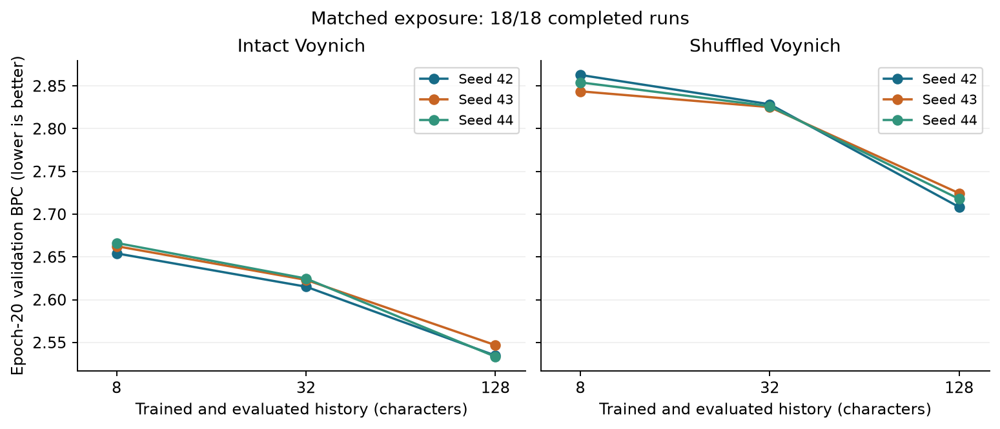
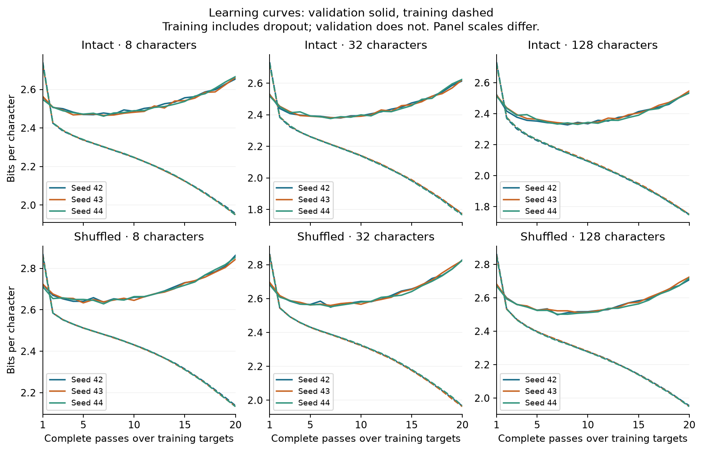
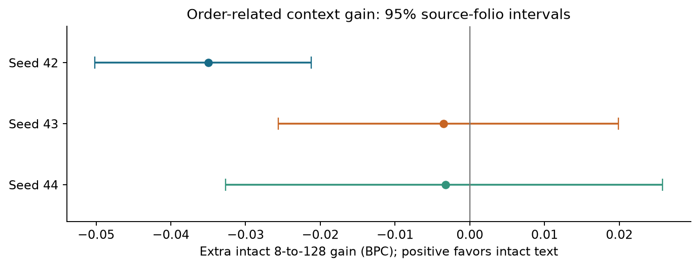

# Matched-context experiment

Complete: **18/18 runs**. Snapshot: 2026-09-21T03:47:11+00:00.

The goal is validated meaning recovery and translation. This experiment checks whether a model's apparent dependence on long history survives training it specifically for shorter histories.

**BPC:** bits per scored character; lower is better. **Matched exposure:** every final model has seen 2,511,320 training targets. **Overfitting:** training prediction improves while validation prediction worsens.

## What was done

- Launched 18 fresh character GRU runs with exact 8-, 32-, or 128-character histories; completion is shown above.
- Fixed the comparison to intact and within-line shuffled text across three seeds.
- Preserved the fixed epoch-20 primary comparison, best-epoch diagnostics, and full learning curves.
- Used local hardware and kept final-test pages sealed.

## Why it was done

The previous experiment shortened the history of a model trained on longer windows. This experiment removes that training/evaluation mismatch, but does not guarantee equal convergence or overfitting.

## Results

Only completed, checkpoint-verified runs appear in this graph. Pending conditions are not inferred.

| Data | Seed | Characters | Epoch-20 BPC | Best BPC (secondary) | Best epoch |
|---|---:|---:|---:|---:|---:|
| gc | 42 | 8 | 2.6542 | 2.4689 | 6 |
| gc-shuffle | 42 | 8 | 2.8628 | 2.6369 | 7 |
| gc | 42 | 32 | 2.6153 | 2.3797 | 8 |
| gc-shuffle | 42 | 32 | 2.8286 | 2.5493 | 7 |
| gc | 42 | 128 | 2.5347 | 2.3277 | 8 |
| gc-shuffle | 42 | 128 | 2.7084 | 2.4988 | 7 |
| gc | 43 | 8 | 2.6626 | 2.4655 | 7 |
| gc-shuffle | 43 | 8 | 2.8437 | 2.6336 | 5 |
| gc | 43 | 32 | 2.6232 | 2.3814 | 7 |
| gc-shuffle | 43 | 32 | 2.8252 | 2.5599 | 7 |
| gc | 43 | 128 | 2.5469 | 2.3365 | 8 |
| gc-shuffle | 43 | 128 | 2.7245 | 2.5123 | 9 |
| gc | 44 | 8 | 2.6664 | 2.4612 | 7 |
| gc-shuffle | 44 | 8 | 2.8541 | 2.6288 | 7 |
| gc | 44 | 32 | 2.6248 | 2.3760 | 7 |
| gc-shuffle | 44 | 32 | 2.8263 | 2.5521 | 7 |
| gc | 44 | 128 | 2.5334 | 2.3309 | 9 |
| gc-shuffle | 44 | 128 | 2.7179 | 2.5019 | 8 |

Training loss is accumulated as weights change with dropout enabled. Validation uses the epoch-end weights with dropout disabled. Their absolute levels are not a perfectly controlled comparison; a sustained rise in validation loss after its minimum is the relevant overtraining diagnostic.

**Observed:** 18 completed runs finish more than 0.02 BPC worse than their best validation epoch. This descriptive threshold flags curves for inspection; it is not a selection rule. Do not interpret the final-score difference as a pure measure of how much history the text needs.

## Primary interaction

Extra intact gain = (intact BPC at 8 − intact BPC at 128) − (shuffled BPC at 8 − shuffled BPC at 128). Positive means longer history helps intact text more.

| Seed | Extra intact gain (BPC) | 95% source-folio interval |
|---:|---:|---|
| 42 | -0.0350 | [-0.0501, -0.0212] |
| 43 | -0.0035 | [-0.0256, 0.0199] |
| 44 | -0.0033 | [-0.0327, 0.0258] |

Across seeds: mean -0.0139 BPC; range [-0.0350, -0.0033].

Mean 8-to-128 gain is **0.1227 BPC for intact text** and **0.1366 for shuffled text**. One seed favors shuffled text; two have intervals spanning zero. This experiment did not establish an extra long-history advantage for intact text. These three seeds share the same corpus and split; they are training replications, not independent manuscript samples.

All 18 models reach their best validation epoch between passes 5 and 9, then worsen before the fixed pass-20 comparison. The fixed budget is auditable, but it does not equalize convergence or overfitting. We retain the primary result and its limitation; we do not replace it with a more favorable checkpoint selection.

Each within-text contrast checks identical targets. The interaction resamples matching source folios together across original and shuffled text; their strings are not treated as identical. Intervals use 2,000 draws across 15 folio groups. They do not capture every source of model or design uncertainty.

## Implication for translation

A stable positive interaction would identify an order-related prediction effect, not a word meaning. A null interaction would not rule out meaningful text. Overfitting or incomplete training limits either interpretation. The [first controlled recovery benchmark](../decipherment/REPORT.md) is now complete: spaced substitution recovered all normalized Italian words under declared cipher assumptions. Space-free word recovery remains poor. The proposed next semantic work is better segmentation tested on fresh passages, then fewer supplied cipher hints. We should not keep extending the prediction track indefinitely.

## Records

- [Overall goal and complete research record](../../RESEARCH_LOG.md)
- [Fixed protocol](../MATCHED_PLAN.md)
- [Current numerical results](../MATCHED.md)
- [Snapshot used for these figures](snapshot.json)
- [Final checkpoint, exposure, input-hash, and resource verification](verification.json)
- Regenerate with `python -m experiments.matched_report` in an environment with matplotlib and NumPy.
