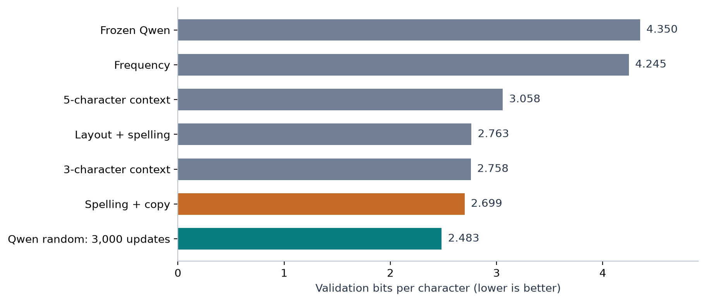
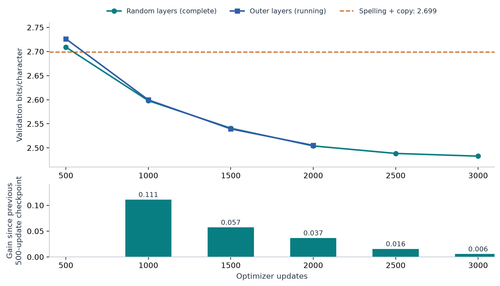
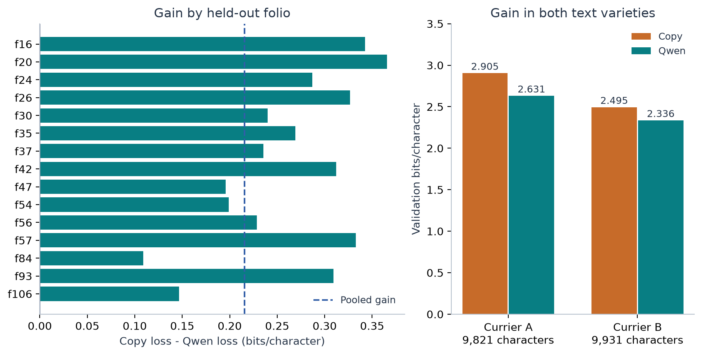
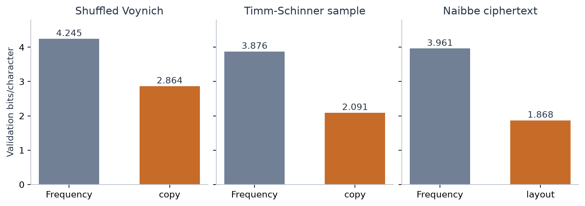

# Voynich: prediction before interpretation

Interim experiment report | Snapshot: 2026-09-20 11:42:04 UTC

This project tests whether adapting a small part of Qwen improves prediction of Voynich transcription text.

**Main finding:** the completed 3,000-update run reaches **2.483 bits per character**, versus **2.699** for the strongest implemented baseline: **8.0% lower loss**.

**Bits per character (BPC):** the model's prediction loss divided by the number of scored transcription characters; lower is better.

**Validation:** pages excluded from parameter fitting but used to choose settings and checkpoints.



Figure 1. Same GC validation target text: 29 pages, 19,752 scored characters. Frozen Qwen is the saved pre-adaptation reference. These bars compare prediction loss, not translation accuracy.

1. **What was done.** Repaired data preparation and scoring; measured five simple predictors; ran three 400-update pilots and a completed 3,000-update random-layer experiment.

2. **What is still running.** Outer-layer training is running; this snapshot includes checkpoints through 2,000 updates. The five-seed study and neural text controls are not yet results.

3. **Why this matters.** Qwen now captures predictive regularities missed by our current baseline. The result does not identify what any Voynich word means.

## 01 / What the experiment measures

The experiment predicts the next piece of a transcription from preceding text.

**Thesis:** compare models on identical held-out characters before making claims about language or meaning.

**Token:** one input unit used by a model; Qwen subwords and baseline characters are different units.

**LoRA adapter:** a small set of trainable weight updates; here, 1,245,184 parameters across four of Qwen's 28 layers.

**Folio:** a manuscript leaf; its front and back stay in the same split to reduce leakage.

```text
Parse GC2a-n.txt and preserve page metadata
Group related pages into fixed splits
Fit predictors on training pages
Score each validation target once
Select checkpoints using validation loss
Keep final-test scores sealed
```

| Split | Pages | Folio groups | Characters used |
| --- | --- | --- | --- |
| Training | 148 | 69 | 125,614 |
| Validation | 29 | 15 | 19,752 |
| Final test | 30 | 14 | Not scored |

1. **Representation.** The main source, `GC2a-n.txt`, uses v101 transcription, not EVA. Paragraph text is modeled. Line breaks, paragraph breaks and uncertain boundaries are preserved; unreadable `?` targets are excluded. A normalized character is not necessarily one original manuscript glyph.

2. **Loss.** BPC = summed negative log probability / (scored characters x ln 2). Assigning probability 1/2 to a character costs 1 bit; assigning 1/4 costs 2. An 8% BPC reduction does not mean 8 percentage points more accuracy.

3. **The copying baseline.** It mixes 80% smoothed prediction from the previous three characters with 20% copy continuation. It searches the previous 256 characters for strings of length 2, 3 or 4, allowing one mismatch. Its 2.699 BPC score is not attributable to copying alone.

4. **Fair comparisons.** Hash checks confirm all primary checkpoints and the copy baseline score the same targets. Qwen's subword accuracy is not directly comparable with baseline character accuracy. The frequency predictor is a learned non-contextual reference, not uniform random guessing.

## 02 / Longer training changed the result

The learning curve records held-out loss after each 500 optimizer updates.

**Thesis:** 3,000 updates established a useful gain, but the last 500 added little compared with the first extensions.

**Optimizer update:** one weight adjustment; here it accumulates gradients from two one-window batches.



Figure 2. Fresh 3,000-update schedules, seed 42, context 64, stride 32. The lower panel shows the random-layer run's incremental gain. Missing outer checkpoints are unfinished work, not extrapolated values.

1. **The earlier result was budget-specific.** At 400 updates, random layers scored 2.878, outer layers 2.937 and middle layers 3.155; all lost to the 2.699 baseline. These pilots used a different cosine learning-rate schedule, so their endpoints are not points on the curves above.

2. **Returns are diminishing.** Random layers improved by 0.111 BPC from 500 to 1,000 updates, but only 0.0056 from 2,500 to 3,000. This schedule lowers the learning rate toward zero; the curve does not prove that all further training would fail.

3. **Layer location remains unresolved.** At 2,000 updates, random layers scored 2.5040 and outer layers 2.5052. This one-seed comparison gives no persuasive reason to call the outer layers uniquely language-dependent. We have not tested preservation of English or Italian abilities.

## 03 / How convincing is the gain?

The completed random-layer model improves prediction across held-out manuscript material.

**Thesis:** the gain is consistent across these folios, but validation reuse and a single training seed limit the claim.

**Paired bootstrap:** repeatedly sample the same folio groups for both models and recalculate their loss difference.

**Training seed:** controls random initialization and training order; variation across seeds is a separate uncertainty.



Figure 3. Random layers, selected step 3,000. Positive values favor Qwen; 15/15 folios improve. The dashed line is the character-weighted pooled gain, not the unweighted average of folio bars.

1. **Measured effect.** Copy loss minus Qwen loss is **0.2158 BPC**. A paired bootstrap over 15 folio groups gives a 95% interval of **[0.1722, 0.2914]**, using 2,000 draws. All values favor Qwen in this comparison.

2. **Selection limits certainty.** The same 29 pages chose the checkpoint and support the interval. The interval is exploratory; it does not account for model selection, training-seed variability or pretraining exposure to public Voynich text. The final test has not been scored.

3. **Two varieties improve.** Currier A falls from 2.905 to 2.631 BPC; B falls from 2.495 to 2.336. A/B are statistical text varieties, not established source languages. The 22 A pages and 7 B pages have similar character totals; their page counts alone would misstate their weights.

## 04 / Prediction is not decipherment

Controls test whether a result could arise without recovering meaning.

**Thesis:** lower loss on Voynich is only informative about meaning when competing explanations are tested.

**Control text:** altered or generated text designed to preserve some properties while changing others.



Figure 4. Existing simple-model results on three control datasets. Compare bars within each panel; different target strings and alphabets prevent interpreting absolute BPC differences between panels as a language ranking. Neural control runs are pending.

1. **Local structure survives shuffling.** Shuffling words within each line leaves the copy baseline at 2.864 BPC, still well below its 4.245 frequency reference. This destroys the original order while retaining words and line membership. Neural gains must be measured against each control's own baseline.

2. **Generators provide an alternative.** The [Timm-Schinner self-citation materials](https://github.com/TorstenTimm/SelfCitationTextgenerator) provide algorithmically generated text. Our sampled control's copy score is 2.091 BPC. Predictable generated text shows why predictability alone is not a meaning test.

3. **Known plaintext provides a method check.** [Greshko's Naibbe cipher](https://github.com/greshko/naibbe-cipher) encrypts Latin and Italian reversibly. Its strongest current baseline here is the layout model at 1.868 BPC. Predicting this ciphertext and recovering its held-out plaintext are distinct tasks; neither has established a Voynich translation.

4. **Current gaps.** Each synthetic control uses one published sample, split into chronological blocks. These are not independent generator realizations. ZL/EVA, boundary variants and held-out quires have baseline results only; the main neural gain has not yet passed those robustness checks.

## 05 / What to do next

Use a **replicate-then-explain** research sequence.

**Thesis:** spend the next local compute budget on explaining the 0.216 BPC gain before extending the same run again.

**Context ablation:** shorten the preceding text available to the same trained checkpoint, while keeping evaluation targets fixed.

```text
Finish the two 3,000-update primary runs
Select the promising configuration
Repeat with seeds 43, 44, 45 and 46
Run shuffled, Timm-Schinner and Naibbe controls
If gains survive replication:
    Compare 16-token and 64-token context on the same targets
    Test stronger baselines and alternative transcriptions
If independent evidence supports interpretation:
    Validate known-plaintext recovery
    Test constrained Voynich mappings on unseen material
```

1. **Finish the queued evidence.** The existing local monitor is set to complete the primary comparison, then run four extra seeds and three neural controls. Keep the winning four layer positions fixed across seeds. This measures training stability for one subset, not robustness across random layer subsets.

2. **Find the source of the gain.** Evaluate the selected checkpoint at contexts 16 and 64 with identical target masks; repeat on controls. If the gain remains with short context, local patterns are sufficient for that gain. If longer context helps Voynich more than controls, test what distant information matters. A 256-token extension should be separate: the present adapter trained at context 64.

3. **Challenge the baseline and representation.** Add a stronger variable-length character predictor or small character model, tune on validation, and repeat matched comparisons on ZL/EVA and boundary variants. Record character exposure and local runtime; equal update counts alone do not equalize data exposure across tokenizations.

4. **Set a translation gate.** First test recovery of held-out known plaintext from newly generated Naibbe examples with held-out keys and texts. For Voynich, require independently annotated text-image associations within section and hand, then consistent predictions on unseen pages. Fluent English or Italian is not a correctness test. Defer SAEs and broad layer-localization claims until a specific causal question exists.

**Longer runs become worthwhile** if repeat seeds show a stable advantage and a revised schedule or context budget tests a stated hypothesis. Do not open final-test scores until the comparison and selection rule are fixed.

## 06 / Provenance and reproducibility

This is a frozen snapshot of local experiments, not a completed decipherment study.

**Snapshot:** 2026-09-20 11:42:04 UTC. **Scope:** validation only; no final-test scoring. Training continued independently while this report was written.

| Setting | Value |
| --- | --- |
| Model | mlx-community/Qwen3-1.7B-bf16; 28 layers |
| Pinned model revision | 9cd6692855d3e06772228e9a962b2606359b2d24 |
| Layer positions (zero-based) | Random: 0, 3, 20, 23. Outer: 0, 1, 26, 27. |
| Adapter | Rank 8; alpha 16; dropout 0; seven attention/MLP projections per layer |
| Training | 3,000 optimizer updates; batch 1; accumulation 2; seed 42 |
| Context / schedule | 64 tokens; stride 32; learning rate 0.0001; cosine decay |
| Checkpoint selection | Validation every 500 updates; lowest validation BPC |
| Hardware | Local Apple Silicon MPS; BF16; 36 GiB unified memory |
| Training data | 2,935 overlapping windows; targets scored once per evaluation |

### Recorded evidence

`experiments/report/snapshot.json` contains the numerical snapshot and SHA-256 hashes of its inputs. The completed random run's exported adapter was checked against its selected checkpoint. All primary checkpoint target hashes match the copy baseline.

The report builder reads saved scores only. `python -m experiments.research_report` reproduces the saved report using matplotlib and reportlab. Use `--capture` only after refreshing `experiments.learning_curves` to create a newer snapshot; review the narrative when experiment status changes.

The frozen Qwen reference used evaluation batch size 2; the long adapted runs use 1. BF16 batch-shape rounding can cause small differences. The comparison with the copy baseline uses the same scored target characters.

### Primary sources and research boundary

[Yale's manuscript description](https://beinecke.library.yale.edu/beinecke/collections/beinecke-cipher-voynich-manuscript) describes the text as undeciphered. This study has no accepted Voynich plaintext labels and makes no translation claim.

[Timm & Schinner (2019), A possible generating algorithm of the Voynich manuscript](https://doi.org/10.1080/01611194.2019.1596999), with the authors' code and sample materials linked on page 5.

[Greshko (2025), The Naibbe cipher](https://doi.org/10.1080/01611194.2025.2566408), with the author's reversible cipher implementation and datasets linked on page 5.

Sources checked on 2026-09-20. Their broader claims have not been independently reproduced here. See `RESEARCH_PLAN.md` for the wider reading list.
