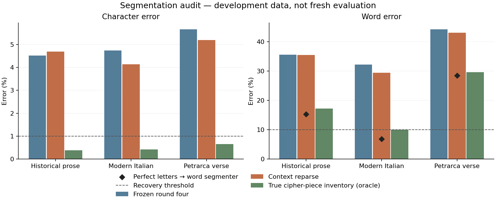

# Separate the segmentation bottlenecks

Development-only audit of the three existing 5,200-letter streams. The round-four
prior, cipher decoder and word segmenter are unchanged. No Voynich text or fresh
evaluation answers are used.

**What was done**

- Measured word recovery from error-free letters.
- Recreated round four and compared one fixed-key context-reparse change on the
  same ciphertexts and keys; no parameter sweep.
- Repeated the true cipher-piece inventory diagnostic, including lexical polish
  and final word segmentation.
- Archived ciphertexts, predictions, diagnostic answers, settings and code hashes.

**Why**

The previous end-to-end word error combined cipher parsing, wrong letters and wrong
spaces. Separate diagnostics show which stage needs work before another fresh test.

## Results

Character error / word error use edit distance. Lower is better. An oracle receives
information unavailable to a real solver; it is a diagnostic, not a candidate.

| Development stream | Word error with perfect letters | Round four CER / WER | Reparse CER / WER | True inventory oracle CER / WER |
|---|---:|---:|---:|---:|
| Historical prose | 15.3% | 4.52% / 35.5% | 4.69% / 35.4% | 0.38% / 17.2% |
| Modern Italian | 6.9% | 4.73% / 32.3% | 4.13% / 29.4% | 0.42% / 10.0% |
| Petrarca verse | 28.5% | 5.65% / 44.2% | 5.19% / 43.0% | 0.65% / 29.7% |



The modern oracle word error is 10.03%, slightly above the 10% gate; the table
rounds word error to one decimal.

Mean across the three streams: round-four CER **4.97%**,
reparse **4.67%**; word error
**37.3%** versus **36.0%**.
The candidate fails the predeclared development selection. It is not promoted; no fresh passages are consumed.

## Word-boundary diagnosis with perfect letters

| Stream | Reference tokens absent from word lexicon | Extra spaces | Missing spaces |
|---|---:|---:|---:|
| Historical prose | 5.6% | 92 | 22 |
| Modern Italian | 2.2% | 31 | 16 |
| Petrarca verse | 10.2% | 161 | 98 |

These are descriptive counts, not causal attribution. A missing word can still be
segmented correctly by the unknown-word model, and a known word can be split
incorrectly. [Word diagnostics](word-diagnostics.json) retain missing-word examples.
The corpus-normalized spelling and word boundaries are the reference convention;
this does not establish a unique historical manuscript spelling.

## What the targeted change tests

```text
Keep the round-four role-specific cipher key fixed
Enumerate known whole-token and prefix+suffix readings
Search passage context with a 128-state beam
Score character bits, length and role-specific homophone choices
Retain the unchanged parse if its conditional score is lower
```

The earlier greedy reparse used only left context. This experiment tests a passage
beam with full five-gram context and explicit homophone choice cost after the newer
round-four repair. It cannot invent missing pieces or revise wrong key entries.
The key/inventory and one whole/split bit per token are constants. This is a
conditional fixed-key code, **not** a general cipher-family MDL comparison.
A lower score is not the same as lower error: development references are used only
to judge the candidate after decoding.

Selection was declared in [PROTOCOL.md](PROTOCOL.md): at least one percentage point
lower mean character error, no stream more than one point worse, and no higher
mean word error. No settings changed after seeing these results. All runs finished
without reported caps: yes.

## Interpretation and limits

1. **Spaces have their own error budget.** Even exact letters leave historical word
   errors. This measures the current segmenter on these streams, not an unavoidable
   limit for Italian. Character recovery alone cannot certify word recovery.
2. **The piece inventory remains a useful diagnostic.** Its oracle is a strong
   intervention using the true encoder pieces. Its low letter error motivates
   joint inventory/parse work, but does not show that unknown pieces can be learned
   from real Voynich text.
3. **This is paired development evidence only.** Three already-used streams and one
   encryption seed; no cross-author test, confidence interval or significance claim.
   The historical prose stream uses Novellino/Decameron development tales and the
   verse stream uses Petrarca development poems. Neither is a new hidden author.

For the perfect-letter audit the incomplete terminal word is excluded. End-to-end
word error includes the terminal fragment consistently across all three decoders;
therefore the diamond markers and bars have a small reference-boundary difference.
The character denominator is always 5,200. No change to the CER <= 1%, WER <= 10%
recovery gate; no Voynich mechanism run is earned.

## Next decision

Keep round four as the baseline. If this candidate is not selected, do not spend
fresh evaluation passages on it. The next separately declared development experiment
should address historical word boundaries on perfect letters; a useful first
comparison is the frozen prose word model against a word model fitted only on the
already-designated prose and Petrarca **training** texts. Freeze selection on the
existing development split, then test a new historical author and a new modern
corpus. Never add the missing development words directly to the lexicon.

Cipher-piece induction remains a separate open problem. A future revision must
learn rare pieces and resolve whole/split ambiguity jointly, or present another
specific testable mechanism; simply running this fixed-key reparse longer is not
supported by this audit. Independent image annotation is tracked separately in
[the image pilot](../../data/folios/object-pilot/REPORT.md).

## Records and reproduction

- [Machine results](results.json): all stages, provenance and the selection decision.
- `historical-predictions.json`, `modern-predictions.json`, `verse-predictions.json`:
  development ciphertexts, references, parses and recovered text (not sealed tests).
- `historical.json`, `modern.json`, `verse.json`: checkpointed grades and cap flags.

```sh
# Read recorded results and redraw the report/figures:
.venv/bin/python -m pip install -r experiments/audit_report_requirements.txt
.venv/bin/python -m experiments.report_segmentation_audit
# Recheck sources, ciphertext, score and grades without cipher search:
.venv/bin/python -m experiments.verify_segmentation_audit
# Tests of exhaustive toy parses, length code and homophone penalties:
.venv/bin/python -m unittest tests.test_context_reparse
# Full rerun into a new directory (never overwrites the archive):
NUMBA_NUM_THREADS=4 OPENBLAS_NUM_THREADS=1 .venv/bin/python -c "from pathlib import Path; import experiments.segmentation_audit as a; a.OUT=Path('tmp/audit-rerun'); a.main()"
```

The audit driver refuses to replace a completed result. On interruption it resumes
verified per-stream checkpoints. Unfinished per-stream computation is rerun. A fresh
clone also needs the pinned artifacts restored as in the repository reproduction guide.
