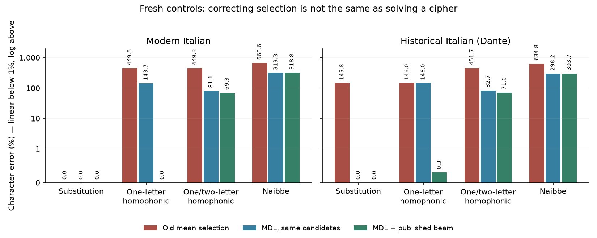
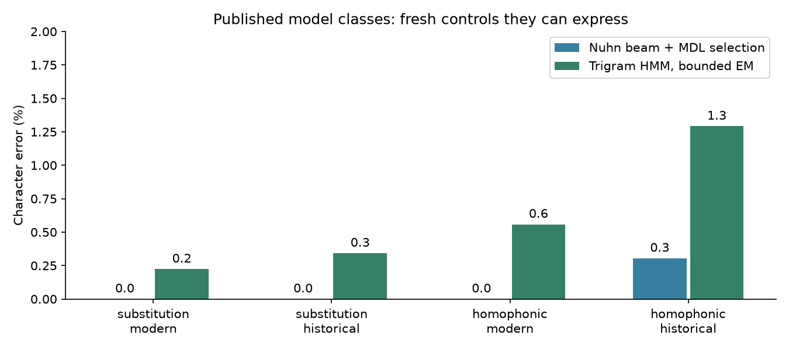
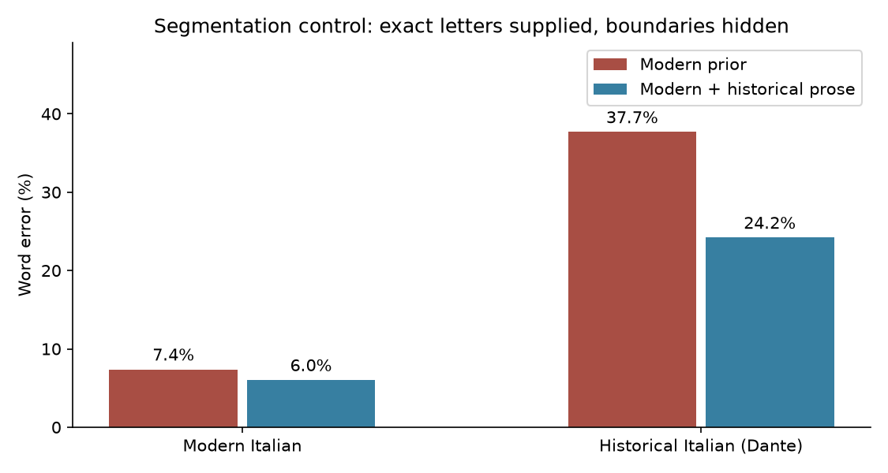

# Length-aware selection and standard decipherment comparators

Frozen method commit: `146fa75ce524c5e20ed18f1308cb9fc1ca65f2fe`. Earlier archive: `28ceb16`.
[Protocol](PROTOCOL.md) · [development](development.json) · [fresh results](results.json) · [sources](sources.json) · [audit](verification.json).

## What was done

- Replaced mean-score candidate selection with total description length, including key and ambiguity costs.
- Implemented Nuhn-style key beam search and a bounded trigram-HMM EM comparator.
- Added Novellino and Decameron training/development prose; evaluated fresh modern and Dante passages.
- Kept the image track parked and the Voynich final test sealed. No paid compute.

## Why

The old decoder sometimes generated the exact letters and then discarded them for a longer
wrong answer. Fixing that defect and adding established search models makes the negative
benchmark more informative; it does not establish that Voynich is a cipher or recover meanings.

## Fresh result

The combined selector recovers exact letters in **7/8** fresh substitution and
one-letter homophonic controls. The full Naibbe recovery gate is **failed**.
No Voynich mechanism experiment was run. All eight substitution/homophonic cases meet
the **letter** threshold; historical word recovery still fails. Historical substitution
CER falls from **145.82% to 0%** by reranking the same candidates. Historical segmentation
WER falls from **37.67% to 24.20%** on identical fresh passages; the previous 39.9% result
was measured on different passages and is not the paired baseline.

**CER:** character insertions, deletions and substitutions divided by reference letters.
**WER:** the same edit count over words. Either can exceed 100% when output expands.
**MDL:** total bits for the proposed plaintext, key, cipher choices and required layout.
**Gate:** CER ≤1% and WER ≤10% on each case; four source passages are the independent samples.



| Cipher | Source | Old mean CER | Same candidates, MDL CER | + beam CER | + beam WER | Gate |
|---|---|---:|---:|---:|---:|---:|
| substitution | modern | 0.00% | 0.00% | 0.00% | 6.02% | 1/2 |
| substitution | historical | 145.82% | 0.00% | 0.00% | 24.20% | 0/2 |
| homophonic | modern | 449.53% | 143.65% | 0.00% | 6.02% | 1/2 |
| homophonic | historical | 146.01% | 146.01% | 0.30% | 26.34% | 0/2 |
| variable-homophonic | modern | 449.35% | 81.06% | 69.30% | 91.65% | 0/2 |
| variable-homophonic | historical | 451.75% | 82.71% | 70.97% | 92.65% | 0/2 |
| naibbe | modern | 668.55% | 313.32% | 318.83% | 500.00% | 0/2 |
| naibbe | historical | 634.76% | 298.21% | 303.69% | 312.10% | 0/2 |

All columns here use the new common prior and segmenter. The first two compare selectors
on exactly the same candidate set; the third adds beam candidates. The old algorithm's
search is retained only as an ablation and as the one/two-letter candidate source.
MDL is the selection criterion; it is not the objective of the archived annealer or HMM.
The character prior changes between those algorithms as documented, so this is not a
pure search-only causal comparison.

## What the score repairs

```text
Generate a candidate plaintext and its key
Charge every plaintext letter under a normalized character prior
Charge key entries and cipher-symbol inventory
Charge choices between homophones and ambiguous chunk boundaries
Choose the complete candidate with the fewest total bits
```

The four new development substitution cases all selected exact letters with MDL; mean
selection failed one. In that case the exact candidate cost **2,835 bits**, versus **6,443 bits**
for the expansion, which had **144.8% CER**. Development examples are not held-out evidence.
On fresh grading, **5 cases** still have a better candidate by oracle CER
than the MDL-selected candidate. MDL encodes the stated model; it does not guarantee truth.
One historical homophonic case still prefers an eight-error candidate (**7,173 bits**)
over the exact candidate (**7,185 bits**), both 1,265 letters long. That is prior/ranking
error rather than the old free-expansion defect. Inventory/key costs especially matter
for large, weakly shared variable-length codebooks.
The criterion is an ideal arithmetic/enumerative code length, not an implemented compressor.

## Published model comparison



| Cipher | Source | Beam-only MDL CER (completed cases) | HMM CER (run cases) |
|---|---|---:|---:|
| substitution | modern | 0.00% (2/2) | 0.22% (2/2) |
| substitution | historical | 0.00% (2/2) | 0.34% (2/2) |
| homophonic | modern | 0.00% (2/2) | 0.56% (2/2) |
| homophonic | historical | 0.30% (2/2) | 1.29% (2/2) |

The beam implementation follows [Nuhn et al. 2013](https://aclanthology.org/P13-1154/)
and the partial-context and extension-order improvements of
[Nuhn et al. 2014](https://aclanthology.org/D14-1184/). Development selected width
**2048**: all eight development encodings had zero CER, and 8192
added no gain. Our Italian order-5 prior, adapted order weights, and absence of sentence
boundary symbols differ from the published English experiments. Above 64 cipher types,
extension order falls back to frequency. This is an independent implementation, not an
UNRAVEL run or a replication of published Zodiac accuracy.

The HMM follows the model in [Berg-Kirkpatrick & Klein 2013](https://aclanthology.org/D13-1087/):
fixed trigram transitions, learned emissions and posterior decoding. It uses 200 EM iterations,
.1 emission smoothing and up to eight random restarts. The actual range was
**8–8 restarts**; the paper's
large-restart result is not reproduced. Its character priors and smoothing differ too.
HMM letters may vary across occurrences of one cipher symbol, so this output is graded
separately rather than forced into a deterministic key for MDL selection.

**Model-class limit:** both published methods emit one letter per observed symbol. The genuine
homophonic controls fit that assumption. Naibbe and the variable-length controls do not,
in general. Their failure is an out-of-class stress result; the generic expansion search
also remains bounded. Neither result rules out all variable-length cipher methods.

## Historical segmentation, with letters supplied



| Source | Frozen modern segmenter WER | Added historical prose WER |
|---|---:|---:|
| modern | 7.38% | 6.02% |
| historical | 37.67% | 24.20% |

These are the same four fresh passages, stripped of spaces before the segmenters see them.
They isolate word boundaries from cipher recovery. Novellino and the first two Decameron
days contribute **62,756 training words**, **13,668 development words**, **8,436 historical
word forms**, and **2,995 forms** absent from the original lexicon. Modern ISDT contributes
216,579 training words. Whole tales are split; every fifth tale is development.
No Dante is used for fitting or tuning. The selected segmentation model weights historical
training counts 16×, alpha 1, bigram weight .5. Development WER was 10.26% across 12 modern sentences and 24 historical 80-word windows.
This changes word counts and transitions as well as vocabulary; it is not a lexicon-only test.

Dante is a different author from the historical training sources, but the project had already
studied other Dante passages. The new cases are fresh source-ID holdouts, not a previously
unknown author benchmark. Edited orthography, tokenization and poetry/prose differences
remain limitations. Wikisource pages have varying proofreading status; provenance is pinned.

## Audit and limits

- Method, protocol, sources and development results were committed before challenge generation.
- 16 opaque encodings derive from four passages: two modern, two historical; each has 1,200–1,800 letters.
- Earlier benchmark source IDs and exact modern train/dev sentences were excluded; encoder round trips passed.
- Decoder input was ciphertext and unpaired priors. Predictions were saved before opening evaluation answers.
- Exact-letter segmentation controls ran only after cipher predictions were frozen.
- This is procedural blinding on one machine, not an independent evaluator or inaccessible secret store.
- Fresh decoding took **13.3 minutes** on local CPU, excluding setup, development and grading. No paid compute.
- **0 beam runs** hit their CPU cap. Capacity skips and HMM inventory/restart limits are in results.json.
- Seeds, hashes, per-case candidates and selector losses are recorded. No significance claim from four passages.
- Exact challenge, predictions and evaluator references are released in `evaluated-records.tar.gz` only after grading. These passages are now disclosed; exclude them from all future fresh tests.
- The 1.8 MB committed source snapshot preserves the exact transcluded Wiki text, not only top-level page revisions.
- All prior frozen studies are unchanged. No fourth image study, BPC sweep, GPU rental, or final-test scoring occurred.

## Decision

Keep the Voynich mechanism test closed: codebook-free Naibbe has not met the letter-and-word gate.
The contribution is a controlled method benchmark, failure decomposition and reproducible
negative evidence. A translation remains out of reach. The standard-method implementations
add a missing comparator, but four passages, edited historical data, and bounded HMM restarts
do not by themselves establish publication readiness.
