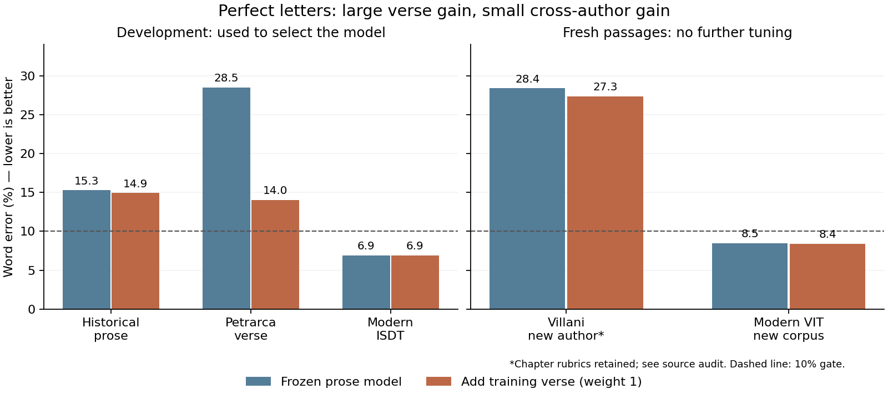

# Verse vocabulary: a development gain that did not transfer enough

This comparison adds training-only Petrarca words to the frozen Italian word segmenter.
The large Petrarca development gain did not meet the declared transfer threshold on Villani.

**What was done**

- Compared weights 1, 4 and 16 against the frozen prose word model on existing development text.
- Committed weight 1, extraction code and grading rules in `5c86127` before fetching fresh sources.
- Saved predictions on four Villani and four modern VIT passages before opening reference spaces.
- Archived sources, revisions, licences, predictions, references and every tried setting. CPU only.

**Why**

The earlier audit found 28.5% word error on perfect Petrarca letters. This isolates
word-space recovery from cipher errors and tests transfer to a previously unused author.

**WER:** word insertions, deletions and substitutions divided by reference word count.
**Boundary F1:** agreement on space positions; it can be high while many words are wrong.
**Transfer threshold:** at least 3 percentage points lower pooled historical WER and
at most 1 point worse modern WER, declared before fresh source preparation.

```text
Add only designated Petrarca training poems at weights 1, 4, 16
Select on existing prose, verse and modern development streams
Commit the selected model and the full fresh-evaluation pipeline
Prepare new Villani and VIT passages; hide spaces and source labels from solver
Save all paired predictions, then grade
If transfer threshold fails, retain the old baseline and stop
```

## Development selection

Each stream ends at the last complete word within 5,200 letters. The word model adds
counts, word transitions and word forms; the segmentation algorithm, beam and scoring
parameters stay unchanged. Every fifth Petrarca poem remains development and is not fitted.
There are 293 training poems. Weight 0 is the old baseline.

| Training verse weight | Historical prose WER | Petrarca WER | Modern ISDT WER |
|---|---:|---:|---:|
| 0 | 15.27% | 28.49% | 6.89% |
| 1 | 14.92% | 14.04% | 6.89% |
| 4 | 15.62% | 13.37% | 7.19% |
| 16 | 16.06% | 14.29% | 7.38% |

Weight **1** minimizes the mean historical prose/verse WER among eligible settings:
21.88% to
14.48%.
Weight 4 helps verse slightly more but has a worse historical mean; it was not selected.
No fresh result was used to revise that decision.



## Fresh results: transfer threshold failed

References use normalized original surface words. All predictions preserve every letter;
character error is **zero by construction**, not a cipher-decoding achievement.
Pooled WER sums edit counts and reference words; it is not an unweighted passage mean.

| Fresh source | Baseline errors / words (WER) | Added verse errors / words (WER) | Improvement | Selected model <=10% WER |
|---|---:|---:|---:|---:|
| Villani | 1357 / 4783 (28.37%) | 1308 / 4783 (27.35%) | 1.02 points | 0/4 |
| Modern VIT | 313 / 3686 (8.49%) | 309 / 3686 (8.38%) | 0.11 points | 2/4 |

Historical improvement is **1.02 points**, below the required **3 points**. The modern
guard passes. No historical passage passes the 10% word gate; only two modern passages
pass it. The selected model is **not promoted** to the cipher decoder.

| Source / opaque case ID | Letters | Baseline WER | Added verse WER |
|---|---:|---:|---:|
| historical / `96a04c911d31256dced97237` | 5717 | 29.90% | 29.74% |
| historical / `edcb01044cf3d6d70fe0d871` | 5412 | 31.92% | 30.57% |
| historical / `d623b480e3bbc53f710c8bd6` | 5278 | 24.98% | 23.26% |
| historical / `2705b4a4b27082ec648e6944` | 5337 | 26.53% | 25.60% |
| modern / `bc933bf722ed33e82e615c70` | 5215 | 7.00% | 7.00% |
| modern / `02ca9d5cff1afa3f8c9df239` | 5203 | 5.36% | 5.14% |
| modern / `eec6f037fbf7269e6a0471f4` | 5285 | 10.84% | 10.84% |
| modern / `6d3f95758be51b0e457bf84b` | 5239 | 10.54% | 10.33% |

| Source / method | Boundary precision | Recall | F1 | Extra spaces | Missing spaces |
|---|---:|---:|---:|---:|---:|
| historical / baseline | 85.73% | 95.82% | 90.49% | 762 | 200 |
| historical / verse | 86.16% | 96.02% | 90.83% | 737 | 190 |
| modern / baseline | 96.44% | 98.59% | 97.50% | 134 | 52 |
| modern / verse | 96.46% | 98.56% | 97.50% | 133 | 53 |

## Source audit and protocol deviation

After grading, inspection found that Wikisource encodes chapter rubrics as ordinary
`p` elements, starting with a Roman numeral on its own line. The frozen extractor
removes HTML headings but retained these rubrics. Seven included rubrics contribute
**107 of 4,783 historical words (2.24%)**. Chapter labels
are `unlabelled` in intermediate rows; paragraph IDs still identify exact source spans.
This violates the intended prose-only extraction. Treat Villani as a fresh paired
diagnostic with this caveat, **not a clean confirmatory prose test**. No corrected
challenge was substituted and no favourable subset was regraded.

The fixed passage packer also skips 30 short historical paragraph residuals when
the next whole paragraph would exceed 6,000 letters. Their IDs are recorded in the
challenge's `excluded_source_ids`; that field combines overlap rejections and packing
residuals. A replay of the source and overlap rules reproduces the exact passages.
This is sequential size-based selection, not random sampling or selection by score.

## What the result means

1. **Coverage helps within an author.** Held-out Petrarca poems improve from 28.49% to
   14.04% WER after fitting other Petrarca poems. This supports the value of relevant
   word data; it does not establish robust historical Italian recovery.
2. **Transfer remains weak.** Villani improves from 28.37% to 27.35% WER. Four passages
   from one author are not four independent authors, and the rubric caveat limits
   the planned prose claim. There is no confidence interval or significance claim.
3. **Spaces still fail on exact letters.** The selected model produces 737 extra and
   190 missing spaces on Villani. These are descriptive counts, not proof that one
   vocabulary change or score parameter causes the errors.
4. **Meaning recovery remains unearned.** This is word segmentation only. The latest
   Naibbe round remains 5.7% character error and about 45% word error on Dante, against
   the 1% / 10% gate. No Voynich text was scored and no translation claim is supported.

## Decision and next bounded work

Keep round four and its old word model as the recovery baseline. Stop this weight
sweep. Before another fresh evaluation, add a source-fixture test for paragraph-encoded
rubrics in a new extractor version; never rewrite the frozen extractor. Use existing
development passages to distinguish missing historical forms from known words split
incorrectly. A later candidate needs its own declared mechanism, development threshold
and committed freeze. Exclude all released source IDs from future hidden evaluation.
Do not spend another Naibbe or Voynich test passage merely on this verse-word addition.

## Provenance, licences and reproduction

- [Protocol](PROTOCOL.md), [development](development.json), [freeze](freeze.json),
  [results](results.json), [evaluated records](evaluated-records.json),
  [source audit](source-audit.json), [archive hashes](archive.json).
- Villani: [Nuova Cronica, Libro primo, revision 3734101](https://it.wikisource.org/w/index.php?oldid=3734101).
  Public-domain original; Wikisource transcription CC BY-SA, with source/history
  attribution retained. Edited transcription, not a diplomatic manuscript edition.
- Modern: [UD Italian VIT](https://github.com/UniversalDependencies/UD_Italian-VIT/tree/12fc5f682a677e87dac1923903ae954d8441f7b7),
  test split at commit `12fc5f682a677e87dac1923903ae954d8441f7b7`. Fabio Tamburini,
  Maria Simi, Cristina Bosco and UD contributors. **CC BY-NC-SA 3.0**; its README and
  licence are included in the source archive. Research redistribution is not an
  unrestricted commercial licence.
- [Source manifest](sources.json) records raw hashes and revisions;
  [source archive](fresh-sources.tar.gz) includes challenge and solver outputs.
  Exact shared 20-word strings with fitting/development text were excluded. This
  check is not proof of complete provenance independence.
- Blinding is procedural on one machine, not independent third-party evaluation.
  The solver received only opaque IDs and dense letters. References were disclosed
  only after both methods' predictions were saved.

With the existing baseline and training archives restored as in
[REPRODUCE.md](../../docs/REPRODUCE.md):

```sh
.venv/bin/python -m experiments.word_segmentation_records restore
.venv/bin/python -m experiments.word_segmentation_records verify
.venv/bin/python -m experiments.report_word_segmentation
.venv/bin/python -m unittest discover -s tests -v
```

Verification replays source extraction and passage selection, regrades saved predictions
and development selection, and checks the committed freeze. It does not refit models
or consume a new test. The original `prepare`, `solve`, `evaluate` sequence is preserved
in `experiments/word_segmentation_fresh.py`; do not rerun `prepare` on the released test.
